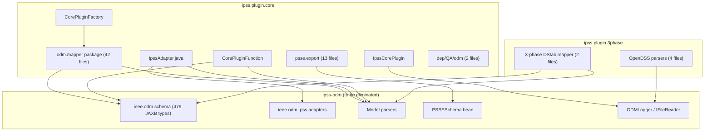

# Fully Eliminate the ODM Dependency

## Current State

The ACLF import path has been migrated to direct file-to-model adapters (Phases 1-5 of the prior plan). The remaining ODM usage falls into these categories:

- **42 mapper files** in `org.interpss.odm.mapper` (Aclf remnants, Acsc, DStab, Opf, Dist, DcSys, MultiNet)
- **13 PSS/E JSON export files** using `PSSESchema` bean and `IODMModelParser.BusIdPreFix`
- **IpssAdapter.java** routing for IEEE_ODM, Acsc/DStab multi-file, Custom format
- **CorePluginFunction.java** with 5 remaining ODM mapping functions
- **CorePluginFactory.java** with remaining ODM mapper factory methods
- **IpssCorePlugin.java** using `ODMLogger`
- **4 OpenDSS parsers** in `ipss.plugin.3phase` using `ODMLogger`, `IFileReader`, `ODMTextFileReader`
- **2 DStab 3-phase mapper files** in `ipss.plugin.3phase`
- **2 deprecated QA files** in `dep/QA/odm/`
- **64 test files** across both modules

## Dependency Graph



---

## Phase 1: Trivial Infrastructure (Low Effort, High Value)

Replace simple ODM utility dependencies that have no semantic connection to the ODM data model.

### 1a. Replace `ODMLogger` references

`ODMLogger` is a deprecated `java.util.logging.Logger` wrapper. All usages are for setting log levels.

- [IpssCorePlugin.java](ipss.plugin.core/src/main/java/org/interpss/IpssCorePlugin.java) -- remove `ODMLogger.getLogger().setLevel(...)` call; use SLF4J or remove entirely
- [CorePluginTestSetup.java](ipss.test.plugin.core/src/test/java/org/interpss/CorePluginTestSetup.java) -- remove `ODMLogger` import/usage
- 4 test files (`Mod_SixBus_DclfPsXfr`, `SixBus_DclfPsXfr`, `SixBus_DclfPsXfr_pwd`, `SixBus_XfrControl_pwd`) -- remove `ODMLogger` import/usage
- 4 OpenDSS parsers in `ipss.plugin.3phase` -- replace `ODMLogger` with SLF4J `LoggerFactory.getLogger()`

### 1b. Replace `IFileReader` / `ODMTextFileReader`

Used by 4 OpenDSS parsers in `ipss.plugin.3phase`:
- [OpenDSSDataParser.java](ipss.plugin.3phase/src/main/java/org/interpss/threePhase/dataParser/opendss/OpenDSSDataParser.java)
- [OpenDSSLineCodeParser.java](ipss.plugin.3phase/src/main/java/org/interpss/threePhase/dataParser/opendss/OpenDSSLineCodeParser.java)
- Others using `ODMTextFileReader`

Create a simple `BufferedReaderWrapper` in ipss.plugin.core that implements the same `readLine()` contract, or just use `BufferedReader` directly.

### 1c. Delete deprecated QA files

- [PSSE2BAPBusComparator.java](ipss.plugin.core/src/main/java/org/interpss/dep/QA/odm/PSSE2BAPBusComparator.java)
- [PSSE2BAPBranchComparator.java](ipss.plugin.core/src/main/java/org/interpss/dep/QA/odm/PSSE2BAPBranchComparator.java)

---

## Phase 2: PSS/E JSON Export (Moderate Effort, Isolated)

The 13 files in `org.interpss.fadapter.psse.export` depend on:
- `org.ieee.odm.adapter.psse.bean.PSSESchema` -- a Gson-deserialized POJO for PSS/E JSON structure
- `IODMModelParser.BusIdPreFix` -- just the string constant `"Bus"`

### Approach

1. **Copy `PSSESchema` bean** into `ipss.plugin.core` as `org.interpss.fadapter.psse.bean.PSSESchema`. This is a standalone Gson POJO with no other ODM dependencies -- ~30 inner static classes representing PSS/E JSON sections.

2. **Replace `IODMModelParser.BusIdPreFix`** with a local constant in [BasePSSEJSonUpdater.java](ipss.plugin.core/src/main/java/org/interpss/fadapter/psse/export/psse/BasePSSEJSonUpdater.java): `private static final String BUS_ID_PREFIX = "Bus";`

3. Update all 13 import statements.

---

## Phase 3: Acsc (Short Circuit) Direct Pipeline (Significant Effort)

### 3a. Create `AcscNetworkBuilder`

Extend `AclfNetworkBuilder` with methods for short-circuit data:
- `setScContributingBus(busId, scCode)` -- set bus SC contribution type
- `setGenSequenceZ(busId, genId, z1, z2, z0)` -- positive/negative/zero sequence impedance
- `setLoadSequenceZ(busId, loadId, z1, z2, z0)` -- load sequence impedance
- `setLineSequenceZ(branchId, z0, y0)` -- zero-sequence line impedance
- `setXfrSequenceZ(branchId, z0, connection, grounding)` -- zero-sequence transformer data
- `setMutualZ(branchId1, branchId2, z0m)` -- zero-sequence mutual impedance
- `setSwitchedShuntSequence(busId, b0)` -- zero-sequence switched shunt

Reference: [AbstractODMAcscParserMapper.java](ipss.plugin.core/src/main/java/org/interpss/odm/mapper/impl/acsc/AbstractODMAcscParserMapper.java) for the field-by-field mapping logic.

### 3b. Create `PSSEAcscDirectParser`

Parse PSS/E sequence data file (10 sections), populating the `AcscNetworkBuilder`. The 10 sections are:
1. Change code
2. Positive-sequence generator Z
3. Negative-sequence generator Z
4. Zero-sequence generator Z
5. Negative-sequence shunt load
6. Zero-sequence shunt load
7. Zero-sequence branch data
8. Zero-sequence mutual impedance
9. Zero-sequence transformer data
10. Zero-sequence switched shunt

Reference: The 10 mappers in `org.ieee.odm.adapter.psse.raw.impl.acsc/` in ipss-odm.

### 3c. Wire into IpssAdapter

Update `IpssAdapter.FileImportDSL.load(NetType, String[])` to use the direct Acsc parser for 2-file PSS/E loading (LF + sequence) instead of `PSSERawAdapter`.

---

## Phase 4: DStab (Dynamic Stability) Direct Pipeline (Largest Effort)

This is the heaviest phase -- the DStab pipeline handles ~60 distinct dynamic model types.

### 4a. Create `DStabNetworkBuilder`

Extend `AcscNetworkBuilder` (DStab needs sequence data too) with methods for:

**Machine models (6 types):**
- `addClassicMachine(busId, genId, ra, xd, h, d, ...)`
- `addEq1Machine(busId, genId, ra, xd, xq, xd1, Td01, h, d, ...)`
- `addEq1Ed1Machine(...)`, `addEq11Machine(...)`, `addEq11Ed11Machine(...)`
- `addEquivSourceMachine(...)`

**Exciter models (~20 types):**
- `addExcIEEE1981TypeDC1(genId, ...)`, `addExcIEEE1981ST1(...)`, `addExcIEEE1981TypeAC1(...)`
- `addExcIEEE2005TypeST3A(...)`, `addExcIEEE2005TypeST4B(...)`
- `addExcIEEE1968Type1(...)`, various BPA types, etc.

**Governor models (~15 types):**
- `addGovIEEE1981Type1(...)`, `addGovHydroTurbine(...)`, `addGovSteamNR(...)`
- `addGovPSSETGOV1(...)`, `addGovPSSEGAST(...)`, etc.

**Stabilizer (PSS) models (~8 types):**
- `addPssIEEE1A(...)`, `addPssIEEE2ST(...)`, `addPssSimple(...)`, BPA types

**Dynamic loads, relays**

Reference: [MachDataHelper.java](ipss.plugin.core/src/main/java/org/interpss/odm/mapper/impl/dstab/MachDataHelper.java), [ExciterDataHelper.java](ipss.plugin.core/src/main/java/org/interpss/odm/mapper/impl/dstab/ExciterDataHelper.java), [GovernorDataHelper.java](ipss.plugin.core/src/main/java/org/interpss/odm/mapper/impl/dstab/GovernorDataHelper.java), [StabilizerDataHelper.java](ipss.plugin.core/src/main/java/org/interpss/odm/mapper/impl/dstab/StabilizerDataHelper.java).

### 4b. Create `PSSEDStabDirectParser`

Parse PSS/E dynamic data file (model records in `IBUS 'TYPE' ID DATALIST /` format). Route by `DynModelType` to create the appropriate machine/exciter/governor/PSS/load/relay via `DStabNetworkBuilder`.

Reference: `org.ieee.odm.adapter.psse.raw.impl.dstab/` mappers in ipss-odm (~27 mapper classes).

### 4c. Wire multi-file loading

Update `IpssAdapter.FileImportDSL.load(NetType, String[])` to use direct parsers for 3-file PSS/E loading (LF + sequence + dynamic) instead of `PSSERawAdapter`.

### 4d. Update 3-phase DStab mappers

Replace [ODM3PhaseDStabParserMapper.java](ipss.plugin.3phase/src/main/java/org/interpss/threePhase/odm/ODM3PhaseDStabParserMapper.java) and [AbstractODM3PhaseDStabParserMapper.java](ipss.plugin.3phase/src/main/java/org/interpss/threePhase/odm/AbstractODM3PhaseDStabParserMapper.java) to use the new direct DStab pipeline.

---

## Phase 5: Remaining Analysis Types (Lower Priority)

### 5a. OPF (Optimal Power Flow)

Only used by 1 test (`MatpowerOpfMapperTest`) and 2 mapper files. Low usage. Either:
- Create a minimal `OpfDirectParser` for MATPOWER OPF format
- Or remove OPF ODM support entirely if it's unused in production

### 5b. Distribution Network

Used by `ODMDistParserMapper`, `ODMDistNetMapper`, and helper files. Only relevant for IEEE ODM XML format distribution studies. Either:
- Create a direct distribution network builder
- Or deprecate if the 3-phase OpenDSS pipeline (already ODM-free for parsing) is the primary distribution path

### 5c. DC System

Used by `ODMDcSysParserMapper`, `ODMDcSysNetMapper`. Solar/DC network modeling. Similar treatment as Distribution.

---

## Phase 6: Final Wiring and Cleanup

### 6a. Clean up `IpssAdapter.java`

- Remove all `org.ieee.odm` imports
- Remove `odmParser` field, `getAclfParser()`, `getOdmParser()`
- Remove `getAdapter()`, `getPsseAptVer()` methods
- Remove `IEEE_ODM` format handling (or replace with a standalone XML parser if needed)
- Remove `mapAclfNet()`, `mapAcscNet()`, `mapDStabAlgo()`, `mapDistNet()`, `mapDcSysNet()`
- `parsePsseVersion()` -- reimplement without `PSSEAdapter.parsePsseVersion()`

### 6b. Clean up `CorePluginFunction.java`

Remove all 5 remaining ODM mapping functions:
- `AclfXmlNet2AclfNet`
- `AcscParser2AcscNet`
- `DStabParser2DStabAlgo`
- `DistXmlNet2DistNet`
- `DcSysXmlNet2DcSysNet`
- `MapBranchOutageType`

### 6c. Clean up `CorePluginFactory.java`

Remove all remaining ODM mapper factory methods:
- `getOdm2AclfNetMapper()`, `getOdm2AcscParserMapper()`, `getOdm2DStabParserMapper()`
- `getOdm2DistParserMapper()`, `getOdm2DistNetMapper()`
- `getOdm2DcSysParserMapper()`, `getOdm2DcSysNetMapper()`
- `getOdm2OpfParserMapper()`

### 6d. Delete `org.interpss.odm.mapper` package

All 42 files become dead code once direct pipelines replace them.

### 6e. Migrate all test files

- ~15 ACLF tests still using `PSSERawAdapter` directly -- migrate to `CorePluginFactory.getFileAdapter()` or `PSSEDirectParser`
- ~4 Acsc tests -- migrate to new Acsc direct pipeline
- ~13 DStab tests in `ipss.test.plugin.core` -- migrate to new DStab direct pipeline
- ~24 DStab tests in `ipss.plugin.3phase` -- migrate to new DStab direct pipeline
- ~5 BPA tests -- migrate to `BPADirectParser` or delete
- ~1 OPF test -- migrate or delete

### 6f. Remove ODM from `pom.xml`

Remove from parent [pom.xml](pom.xml):
```xml
<dependency>
    <groupId>org.ieee.odm</groupId>
    <artifactId>ieee.odm_pss</artifactId>
</dependency>
<dependency>
    <groupId>org.ieee.odm</groupId>
    <artifactId>ieee.odm.schema</artifactId>
</dependency>
```
And the `ieee.odm.version` property.

---

## Effort Estimate

| Phase | Files touched | Relative effort | Risk |
|-------|--------------|----------------|------|
| Phase 1: Trivial infrastructure | ~12 | Low | Low |
| Phase 2: PSS/E JSON export | ~14 | Low-Medium | Low |
| Phase 3: Acsc direct pipeline | ~8 new + ~6 wire | Medium | Medium |
| Phase 4: DStab direct pipeline | ~10 new + ~30 wire | **Very High** | **High** |
| Phase 5: OPF/Dist/DcSys | ~6-10 | Medium | Low (can skip) |
| Phase 6: Final cleanup | ~80 | Medium | Medium |

Phase 4 (DStab) is by far the largest effort due to the ~60 dynamic model types that each need parsing and builder methods. Consider whether a phased rollout (supporting common models first, rare models later) is appropriate.

## Risk Mitigation

- **Phased approach**: Each phase can be completed and tested independently
- **Regression testing**: Run `CorePluginTestSuite` after each phase
- **DStab model coverage**: Start with the most common IEEE standard models (GENROU, GENSAL, ESST1A, IEEEG1, IEEEST) before rare/BPA-specific models
- **Backward compatibility**: Keep the `org.interpss.odm.mapper` package alive until all phases are complete, allowing both paths to coexist
