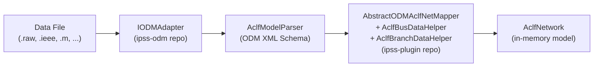
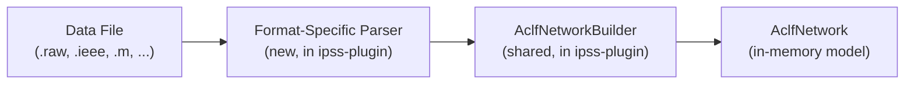

# Bypass ODM Layer: Direct File-to-Model Adapters

## Current Architecture (to be replaced)



Key problem: Two separate repos involved (ipss-odm for parsing, ipss-plugin for mapping), with a heavyweight XML intermediate representation (JAXB schema types) in between.

## Target Architecture



All code lives in ipss-plugin. Each format gets a direct parser that reads the file and calls a shared `AclfNetworkBuilder` to construct the in-memory model. No XML, no ODM dependency.

## Key Design Decisions

- **Shared builder, not shared intermediate model**: Rather than replacing ODM XML types with a new set of intermediate POJOs (which would just recreate ODM with different types), the parsers call `AclfNetworkBuilder` methods directly. The builder encapsulates the model-construction logic currently spread across `AclfBusDataHelper`, `AclfBranchDataHelper`, and `AclfHvdcDataHelper`.

- **Reuse existing parsing logic**: The field-extraction/tokenization logic in the ODM record mappers (e.g., `PSSEBusDataRawMapper`, `PSSELineDataRawMapper`) is well-tested. The new direct parsers should port this logic rather than rewrite from scratch.

- **IpssInternalFormat_in is the proven pattern**: [IpssInternalFormat_in.java](ipss.plugin.core/src/main/java/org/interpss/fadapter/impl/IpssInternalFormat_in.java) already demonstrates direct file-to-AclfNetwork construction using `CoreObjectFactory.createAclfBus()`, `CoreObjectFactory.createAclfBranch()`, and adapter pattern objects (`toPQBus()`, `toPVBus()`, `toSwingBus()`, `toLine()`). The new parsers follow this same approach but with the builder as the abstraction layer.

## Data Elements to Handle

Every format needs to map some or all of these elements:

**Network level**: Base MVA, frequency, areas, zones, owners, xfr Z-correction table, voltage limits

**Bus level**: Bus identity/baseKV, generators (PQ/PV/Swing with limits), loads (constant P/I/Z), fixed shunts, switched shunts (with blocks/steps), SVC/STATCOM

**Branch level**: Lines (R+jX, B, ratings), 2W transformers (tap, phase shift, Z-correction, tap limits), 3W transformers (star bus), phase-shifting transformers

**Special devices**: HVDC 2T-LCC (3-record blocks), HVDC 2T-VSC, FACTS devices, switching devices, flow interfaces

## Phased Implementation

### Phase 1: AclfNetworkBuilder (shared infrastructure)

Create `org.interpss.fadapter.builder.AclfNetworkBuilder` in [ipss.plugin.core](ipss.plugin.core/src/main/java/org/interpss/fadapter/). This class consolidates model-construction logic currently in:
- [AclfBusDataHelper.java](ipss.plugin.core/src/main/java/org/interpss/odm/mapper/impl/aclf/AclfBusDataHelper.java) (~680 lines) -- bus, generator, load, fixed/switched shunt, SVC mapping
- [AclfBranchDataHelper.java](ipss.plugin.core/src/main/java/org/interpss/odm/mapper/impl/aclf/AclfBranchDataHelper.java) -- line, xfr, 3W xfr, PS xfr mapping
- [AclfHvdcDataHelper.java](ipss.plugin.core/src/main/java/org/interpss/odm/mapper/impl/aclf/AclfHvdcDataHelper.java) -- HVDC LCC and VSC mapping
- [AbstractODMAclfNetMapper.java](ipss.plugin.core/src/main/java/org/interpss/odm/mapper/impl/aclf/AbstractODMAclfNetMapper.java) -- network-level, area, zone, interface, post-processing

Key builder methods (accepting primitive/simple Java types, no ODM schema types):

```java
public class AclfNetworkBuilder {
    private final AclfNetwork network;
    
    // Network level
    AclfNetwork createNetwork(double baseMva, ...);
    void addArea(String id, String name, ...);
    void addZone(String id, String name, ...);
    void addXfrZTableEntry(int number, List<ZCorrectionPoint> points);
    
    // Bus level
    AclfBus addBus(String id, String name, long number, double baseKv, 
                   String areaId, String zoneId, int ownerId);
    void addGenerator(String busId, String genId, GenCode code,
                      double pGen, double qGen, double qMax, double qMin,
                      double desiredV, String remoteBusId, double mBase, ...);
    void addLoad(String busId, String loadId, LoadCode code,
                 Complex constP, Complex constI, Complex constZ);
    void addFixedShunt(String busId, Complex yShunt);
    void addSwitchedShunt(String busId, SwitchedShuntMode mode,
                          double vHi, double vLo, List<ShuntBlock> blocks, ...);
    
    // Branch level  
    void addLine(String fromBusId, String toBusId, String ckt,
                 Complex z, double halfB, double rating1, double rating2, double rating3, ...);
    void addXformer2W(String fromBusId, String toBusId, String ckt,
                      Complex z, double fromTap, double toTap, double rating, ...);
    void addXformer3W(String bus1, String bus2, String bus3, String ckt, ...);
    void addPsXformer(String fromBusId, String toBusId, String ckt,
                      Complex z, double fromTap, double toTap, double shiftAngle, ...);
    
    // Special devices
    void addHvdcLine2TLCC(...);
    void addHvdcLine2TVSC(...);
    void addFactsDevice(...);
    void addSwitchingDevice(...);
    void addFlowInterface(...);
    
    // Post-processing (from AbstractODMAclfNetMapper.postAclfNetProcessing)
    void finalizeNetwork();
}
```

### Phase 2: PSS/E RAW Direct Adapter

Create `org.interpss.fadapter.psse.PSSEDirectParser` and update `PTIFormat` to use it. This is the most complex format with ~18 record types and version-specific handling (v26-v36).

Port parsing logic from these ODM mapper classes in ipss-odm:

| ODM Mapper (ipss-odm) | New Parser Method | Records |
|---|---|---|
| `PSSEHeaderDataRawMapper` | `parseHeader()` | 3-line header, system-wide data |
| `PSSEBusDataRawMapper` | `parseBuses()` | Bus records |
| `PSSELoadDataRawMapper` | `parseLoads()` | Load records |
| `PSSEGenDataRawMapper` | `parseGenerators()` | Generator records |
| `PSSEFixedShuntDataRawMapper` | `parseFixedShunts()` | Fixed shunt records (v31+) |
| `PSSELineDataRawMapper` | `parseLines()` | Non-transformer branch records |
| `PSSEXfrDataRawMapper` | `parseTransformers()` | 4-5 line transformer records |
| `PSSEAreaDataRawMapper` | `parseAreas()` | Area interchange records |
| `PSSEZoneDataRawMapper` | `parseZones()` | Zone records |
| `PSSEOwnerDataRawMapper` | `parseOwners()` | Owner records |
| `PSSESwitchedShuntDataRawMapper` | `parseSwitchedShunts()` | Switched shunt records |
| `PSSEDcLine2TDataRawMapper` | `parseHvdc2TLCC()` | 3-line HVDC LCC records |
| `PSSEVSCHVDC2TDataRawMapper` | `parseHvdc2TVSC()` | 3-line VSC HVDC records |
| `PSSEFactsDeviceDataRawMapper` | `parseFacts()` | FACTS device records |
| `PSSESwitchingDeviceDataRawMapper` | `parseSwitchingDevices()` | Switching devices (v34+) |
| `PSSEXfrZTableDataRawMapper` | `parseXfrZTable()` | Xfr impedance correction |
| `PSSEInterAreaTransferDataRawMapper` | `parseInterAreaTransfers()` | Inter-area transfer records |

The main orchestrator `PSSEDirectParser` mirrors the section-by-section parsing order in [PSSELFRawAdapter.java](../../ipss-odm/ieee.odm_pss/src/main/java/org/ieee/odm/adapter/psse/raw/impl/PSSELFRawAdapter.java) (lines 167-281), but calls `AclfNetworkBuilder` instead of ODM XML creation methods.

Version-specific section ordering (existing logic to preserve):
- v30 and below: switched shunts appear before xfr Z correction
- v31+: fixed shunts as separate section (before generators)
- v34+: switching devices section, GNE, induction motors
- v36+: voltage droop control, switching device rating sets

### Phase 3: PSS/E JSON (RAWX) Direct Adapter

Create `org.interpss.fadapter.psse.PSSEJsonDirectParser`. Port logic from [PSSEAclfJSonAdapter.java](../../ipss-odm/ieee.odm_pss/src/main/java/org/ieee/odm/adapter/psse/json/impl/PSSEAclfJSonAdapter.java) and its JSON-specific mappers. Uses the same `AclfNetworkBuilder`.

### Phase 4: Simpler Format Direct Adapters

Each adapter follows the same pattern: parse format-specific file, call `AclfNetworkBuilder`.

- **IEEE CDF**: Port from `IeeeCDFAdapter` (ipss-odm). Simple fixed-column format with bus + branch sections. Relatively straightforward.
- **MATPOWER**: Port from `MatPowerAdapter`. MATLAB .m file format, struct-based.
- **UCTE-DEF**: Port from `UCTE_DEFAdapter`. European grid exchange format.
- **GE PSLF**: Port from `GePslfAdapter`. GE Positive Sequence Load Flow format.
- **PowerWorld (PWD)**: Port from `PowerWorldAdapter`. Includes PWD-specific extension data.
- **BPA**: Port from `BPAAdapter`. Multi-file format (load flow + dynamics). Special handling via `load(ctx, filepathAry, ...)`.

### Phase 5: Integration, Wiring, and Cleanup

**Update adapter classes:**
- [PTIFormat.java](ipss.plugin.core/src/main/java/org/interpss/fadapter/PTIFormat.java): Override `load()` to use `PSSEDirectParser` instead of delegating to `IpssFileAdapterBase.loadByODMTransformation()`
- Similarly update `IeeeCDFFormat`, `MatpowerFormat`, `UCTEFormat`, `GEFormat`, `PWDFormat`, `BPAFormat`

**Update base class:**
- [IpssFileAdapterBase.java](ipss.plugin.core/src/main/java/org/interpss/fadapter/impl/IpssFileAdapterBase.java): Remove `loadByODMTransformation()` method and ODM imports once all adapters are migrated

**Update interface:**
- [IpssFileAdapter.java](ipss.plugin.core/src/main/java/org/interpss/fadapter/IpssFileAdapter.java): Remove or deprecate `getODMModelParser()` method (line 145)

**Update entry points:**
- [CorePluginFactory.java](ipss.plugin.core/src/main/java/org/interpss/CorePluginFactory.java): Remove `getOdm2AclfParserMapper()` and related ODM mapper factory methods
- [IpssAdapter.java](ipss.plugin.core/src/main/java/org/interpss/plugin/pssl/plugin/IpssAdapter.java): Rewrite `FileImportDSL.load()` and `getAdapter()` to use direct parsers instead of IODMAdapter. Remove ODM adapter imports.

**Remove ODM dependency:**
- Update `ipss.plugin.core/pom.xml` to remove `org.ieee.odm` dependency (once all import paths are migrated)

**Test migration:**
- Update tests that currently use `PSSERawAdapter` or `IODMAdapter` directly (like the examples in [FileAdapter.md](ipss.plugin.core/docs/md/FileAdapter.md))
- Existing integration tests in [ipss.test.plugin.core](ipss.test.plugin.core/) serve as regression tests -- they test the final AclfNetwork output, so they validate the new direct adapters produce identical results

## Risk Mitigation

- **Regression testing**: Run all existing tests after each phase. The test suite (`CorePluginTestSuite`) validates end-to-end results (loadflow solutions on IEEE standard systems). If the new direct adapters produce the same AclfNetwork, loadflow results will match.
- **Phased migration**: Each format can be migrated independently. If a direct adapter has issues, the ODM path can be temporarily retained for that format until resolved.
- **Unit conversion correctness**: The existing ODM helpers (`ODMUnitHelper`) handle unit conversions (MW/MVA/kV to PU). The new `AclfNetworkBuilder` must replicate these conversions exactly. This is a key source of subtle bugs.
