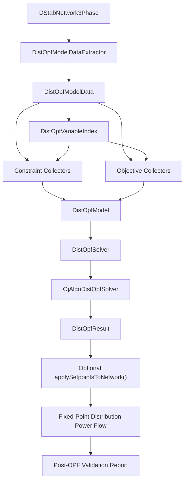

# Java DistOPF Architecture for InterPSS

## 1. Purpose

This document defines the proposed Java architecture for implementing distribution optimal power flow (DistOPF) in InterPSS. The design is inspired by GRIDAPPSD/distopf and by the existing InterPSS OPF framework under `org.interpss.plugin.opf`.

The first implementation target is a single-period, radial, unbalanced three-phase LinDistFlow OPF for `DStabNetwork3Phase`.

## 2. Background Review

### 2.1 GRIDAPPSD/distopf

GRIDAPPSD/distopf provides a useful reference architecture for distribution OPF:

- A case-oriented API that separates input data, formulation, solver, objective, and result mapping.
- Linear distribution power-flow formulations such as LinDistFlow.
- Objective-specific model assembly for loss minimization, curtailment minimization, generation maximization, and target substation P/Q.
- Separate matrix model builders, solver wrappers, and result objects.
- OpenDSS/CIM/CSV import utilities.
- Forward-backward sweep power flow used alongside OPF results.

The Java implementation should reuse these architectural ideas, not the Python dependency stack. InterPSS should not embed pandas, CVXPY, Pyomo, OpenDSSDirect, or Python runtime assumptions for the core Java DistOPF implementation.

InterPSS already has an OpenDSS parser in `org.interpss.threePhase.dataParser.opendss`. DistOPF should leverage that existing `ipss.plugin.3phase` import path for OpenDSS-based test feeders and examples instead of introducing a separate OpenDSS import layer.

### 2.2 Existing InterPSS OPF

The existing InterPSS OPF implementation is under:

```text
org.interpss.plugin.opf
```

Useful framework elements:

- `OpfConstraint`
  - Sparse row container with row id, description, constraint type, bounds, column indexes, and coefficient values.
- `IConstraintCollector`
  - Small collector interface for contributing constraints to a shared container.
- `BaseConstraintCollector`
  - Base class for DC OPF constraint collectors.
- DC constraint collectors
  - `ActivePowerEqnConstraintCollector`
  - `LineMwFlowConstraintCollector`
  - `GenMwOutputConstraintCollector`
  - `BusMinAngleConstraintCollector`
- Objective collectors
  - `BaseObjectiveFunctionCollector`
  - LP/QP-specific objective collectors.
- Solver adapters
  - `ApacheLPSolver`
  - `GIQPSolver`
  - `LpsolveSolver`
  - `OjAlgoDistOpfSolver`, proposed as the default DistOPF adapter for small systems
  - `ApacheLpDistOpfSolver`, a continuous LP DistOPF adapter backed by Apache Commons Math
  - `ORToolsDistOpfSolver`, planned for larger LP/MIP use cases once the native dependency is wired
- Result attachment pattern in `AbstractOpfSolver`.

The collector/objective/solver-adapter pattern is valuable and should be carried forward. The DC OPF equations and network assumptions should not be reused directly because they are based on `OpfNetwork`, bus angle variables, MW-only power balance, and transmission branch-flow approximations.

## 3. Design Decision

DistOPF should reuse the InterPSS OPF framework style, but add distribution-specific model classes.

Use:

- Sparse constraint rows.
- Constraint collectors.
- Objective collectors.
- Solver adapters.
- Explicit result mapping.

Do not directly reuse:

- DC active-power balance equations.
- Bus-angle variable indexing.
- MW-only branch limits.
- `OpfNetwork` as the DistOPF input model.
- Automatic mutation of network state after solve.

The DistOPF input model is:

```text
DStabNetwork3Phase
```

The proposed package is:

```text
org.interpss.threePhase.opf.dist
```

## 4. Architecture Diagram



## 5. Core Data Flow

1. Extract static distribution network data from `DStabNetwork3Phase`.
2. Validate that the v1 feeder is radial and connected from one swing/source bus.
3. Build LinDistFlow variables with stable indexes.
4. Run constraint collectors to assemble sparse equality and inequality rows.
5. Run the selected objective collector.
6. Convert the assembled model into solver-specific matrices.
7. Solve with the selected solver adapter.
8. Map solver variables into `DistOpfResult`.
9. Optionally apply DER setpoints to the InterPSS network.
10. Validate the result by running fixed-point three-phase power flow.

## 5.1 Usage Examples

Run DistOPF on an existing `DStabNetwork3Phase`:

```java
DStabNetwork3Phase net = ...;

DistOpfResult result = ThreePhaseObjectFactory.createDistOpfAlgorithm(net)
		.setControlMode(DistOpfControlMode.PQ)
		.setObjective(DistOpfObjective.CURTAILMENT_MIN)
		.setOptions(new DistOpfOptions()
				.setMinVoltagePu(0.95)
				.setMaxVoltagePu(1.05))
		.solve();
```

Apply solved DER setpoints explicitly and validate with fixed-point power flow:

```java
if (result.isSolved()) {
	result.applySetpointsToNetwork(net);
	new DistOpfPowerFlowValidation().validate(net, result, new DistOpfOptions());
	double maxVoltageDiff = result.getMaxPowerFlowVoltageDiff();
	int pfIterations = result.getPowerFlowIterationCount();
}
```

Use the existing OpenDSS import path in `ipss.plugin.3phase`:

```java
OpenDSSDataParser parser = new OpenDSSDataParser();
parser.parseFeederData("testData/feeder/IEEE123", "IEEE123Master_Modified_v2.dss");
parser.calcVoltageBases();
parser.convertActualValuesToPU(1.0);

DStabNetwork3Phase net = parser.getDistNetwork();
DistOpfResult result = ThreePhaseObjectFactory.createDistOpfAlgorithm(net)
		.setControlMode(DistOpfControlMode.NONE)
		.setObjective(DistOpfObjective.LOSS_MIN)
		.solve();
```

Supported objectives:

- `CURTAILMENT_MIN`: minimizes DER active-power curtailment variables when P control is enabled.
- `GEN_MAX`: maximizes DER active-power output by minimizing negative generation.
- `TARGET_SUBSTATION_P`: minimizes absolute deviation from a target source active-power import.
- `TARGET_SUBSTATION_Q`: minimizes absolute deviation from a target source reactive-power import.
- `LOSS_MIN`: LP proxy that minimizes active import at source outgoing branch phases.

Supported control modes:

- `NONE`: DER P/Q are fixed at extracted values.
- `P`: DER P can move within extracted limits; Q remains fixed.
- `Q`: DER Q can move within extracted/inverter limits; P remains fixed.
- `PQ`: DER P and Q can both move within extracted and inverter capability limits.

## 6. Package Layout

Recommended package structure:

```text
org.interpss.threePhase.opf.dist
org.interpss.threePhase.opf.dist.constraint
org.interpss.threePhase.opf.dist.objective
org.interpss.threePhase.opf.dist.solver
org.interpss.threePhase.opf.dist.util
```

## 7. Public API Classes

### 7.1 `DistOpfAlgorithm`

Main user-facing algorithm.

Responsibilities:

- Hold the target `DStabNetwork3Phase`.
- Hold `DistOpfOptions`.
- Select objective and control mode.
- Build `DistOpfModel`.
- Invoke `DistOpfSolver`.
- Return `DistOpfResult`.

Recommended methods:

```java
DistOpfAlgorithm setObjective(DistOpfObjective objective);
DistOpfAlgorithm setControlMode(DistOpfControlMode controlMode);
DistOpfAlgorithm setOptions(DistOpfOptions options);
DistOpfResult solve();
```

### 7.2 `DistOpfOptions`

Configuration for model building, solver behavior, and validation.

Recommended fields:

- `double minVoltagePu`
- `double maxVoltagePu`
- `double solverTolerance`
- `boolean includeBranchThermalLimits`
- `boolean validateWithPowerFlow`
- `boolean fixedCapacitors`
- `boolean fixedRegulators`
- `int maxPowerFlowIterations`
- `double powerFlowTolerance`

Defaults:

- `minVoltagePu = 0.95`
- `maxVoltagePu = 1.05`
- `includeBranchThermalLimits = true`
- `validateWithPowerFlow = true`
- `fixedCapacitors = true`
- `fixedRegulators = true`

### 7.3 `DistOpfObjective`

Enumeration of supported objectives.

Initial values:

```java
CURTAILMENT_MIN,
GEN_MAX,
TARGET_SUBSTATION_P,
TARGET_SUBSTATION_Q,
LOSS_MIN
```

`LOSS_MIN` is implemented in v1 as an LP proxy that minimizes active import on source outgoing branch phases. A true quadratic I2R loss objective should remain future work until convex QP support and result parity are validated.

### 7.4 `DistOpfControlMode`

Enumeration of controllable DER variables.

Initial values:

```java
NONE,
P,
Q,
PQ
```

## 8. Model Classes

### 8.1 `DistOpfModel`

Solver-neutral optimization model.

Responsibilities:

- Own the variable index.
- Own the sparse constraints.
- Own the objective coefficients or quadratic objective data.
- Own variable lower and upper bounds.
- Provide solver-neutral accessors for solver adapters.

Recommended fields:

- `DistOpfModelData modelData`
- `DistOpfVariableIndex variableIndex`
- `List<OpfConstraint> constraints`
- `double[] linearObjective`
- Optional quadratic objective data for later `LOSS_MIN`.
- `double[] lowerBounds`
- `double[] upperBounds`

### 8.2 `DistOpfModelData`

Immutable static data extracted from `DStabNetwork3Phase`.

Responsibilities:

- Preserve all network data needed to build OPF equations.
- Decouple OPF model assembly from live InterPSS object mutation.

Recommended contents:

- Base MVA and voltage bases.
- Swing/source bus id.
- Ordered buses.
- Ordered branches.
- Bus phase sets.
- Branch phase sets.
- Parent/child topology.
- Per-branch 3x3 phase impedance matrices.
- Per-bus phase load P/Q.
- Per-bus phase fixed capacitor Q.
- Per-bus phase DER P/Q limits.
- Per-bus phase voltage limits.
- Per-branch phase current or apparent-power ratings.
- Fixed regulator ratios.

Important rule:

Dynamic model admittance contributions must not be included. DistOPF uses the static power-flow network model, not the stability-simulation Y-matrix model.

### 8.3 `DistOpfModelDataExtractor`

Extracts `DistOpfModelData` from `DStabNetwork3Phase`.

Responsibilities:

- Read buses, branches, phase codes, impedances, loads, DERs, capacitors, and regulators.
- Build parent/child feeder topology.
- Validate radial topology.
- Normalize values to per-unit on the selected base.
- Return clear diagnostics for unsupported topology or missing data.

### 8.4 `DistOpfVariableIndex`

Stable variable-index registry.

Responsibilities:

- Assign one column number per optimization variable.
- Provide lookup methods for collectors.
- Avoid hard-coded index arithmetic inside collectors.

Variable groups:

- `Pij(branchId, phase)`
- `Qij(branchId, phase)`
- `V2(busId, phase)`
- `Pg(busId, phase)`
- `Qg(busId, phase)`
- `Curtail(busId, phase)`
- Optional slack variables for infeasibility diagnostics.

## 9. Constraint Collector Classes

### 9.1 `IDistOpfConstraintCollector`

Distribution OPF equivalent of `IConstraintCollector`.

Recommended method:

```java
void collectConstraint();
```

### 9.2 `BaseDistOpfConstraintCollector`

Base class for distribution constraint collectors.

Responsibilities:

- Hold `DistOpfModelData`.
- Hold `DistOpfVariableIndex`.
- Hold shared constraint container.
- Provide helper methods for sparse row creation.

Recommended helper methods:

- `addEquality(String desc, double rhs, int[] columns, double[] values)`
- `addLessThan(String desc, double upper, int[] columns, double[] values)`
- `addGreaterThan(String desc, double lower, int[] columns, double[] values)`
- `addBounded(String desc, double lower, double upper, int[] columns, double[] values)`

### 9.3 `DistPowerBalanceConstraintCollector`

Builds active-power balance equations per non-swing bus and phase.

Equation concept:

```text
sum incoming P - sum outgoing P + Pg - Pload - Pcurtail = 0
```

The exact sign convention must be defined once in `DistOpfModelData` and used consistently by all flow and voltage-drop collectors.

### 9.4 `DistReactivePowerBalanceConstraintCollector`

Builds reactive-power balance equations per non-swing bus and phase.

Equation concept:

```text
sum incoming Q - sum outgoing Q + Qg + Qcap - Qload = 0
```

For v1, capacitor injections are fixed. Controllable capacitor switching is future work.

### 9.5 `DistVoltageDropConstraintCollector`

Builds branch voltage-drop equations.

Equation concept:

```text
Vj2 = Vi2 - voltageDrop(Pij, Qij, Rabc, Xabc)
```

The implementation must support unbalanced three-phase coupling using the branch phase impedance matrix. Missing phases should not create variables or constraints.

### 9.6 `DistSwingVoltageConstraintCollector`

Fixes source bus phase squared voltages.

Responsibilities:

- Use the swing/source bus voltage from the InterPSS network when available.
- Fall back to nominal 1.0 pu if configured.
- Create one equality per present source phase.

### 9.7 `DistVoltageLimitConstraintCollector`

Adds lower and upper bounds for each bus phase squared voltage.

Example:

```text
Vmin^2 <= V2(bus, phase) <= Vmax^2
```

### 9.8 `DistDerLimitConstraintCollector`

Adds DER P/Q lower and upper bounds.

Responsibilities:

- Support `NONE`, `P`, `Q`, and `PQ` control modes.
- Fix inactive control variables to their base-case values.
- Use DER capability data from InterPSS where available.

### 9.9 `DistInverterCapabilityConstraintCollector`

Adds inverter capability constraints.

Initial implementation:

- Use linear octagonal approximation for apparent-power capability.
- Support `PQ` and `Q` control modes.

Future implementation:

- Add quadratic circular capability if QP solver support is stable.

### 9.10 `DistBranchThermalLimitConstraintCollector`

Adds branch thermal constraints when ratings are available.

Initial implementation:

- Use a linear octagonal approximation for apparent power per phase.

Future implementation:

- Add quadratic apparent-power constraints if QP support is stable.

## 10. Objective Collector Classes

### 10.1 `BaseDistOpfObjectiveCollector`

Base class for objective builders.

Responsibilities:

- Hold `DistOpfModelData`.
- Hold `DistOpfVariableIndex`.
- Fill linear objective coefficients.
- Optionally fill quadratic objective terms in later phases.

### 10.2 `CurtailmentMinObjectiveCollector`

Minimizes curtailed DER active power.

Used when `DistOpfObjective.CURTAILMENT_MIN` is selected.

### 10.3 `GenMaxObjectiveCollector`

Maximizes controllable DER generation.

Implementation detail:

- Convert maximization to minimization by using negative coefficients.

### 10.4 `TargetSubstationPObjectiveCollector`

Drives substation active power toward a target.

Initial implementation:

- Use positive and negative linear deviation variables.

### 10.5 `TargetSubstationQObjectiveCollector`

Drives substation reactive power toward a target.

Initial implementation:

- Use positive and negative linear deviation variables.

### 10.6 `LossMinObjectiveCollector`

Minimizes estimated feeder losses with an LP approximation.

Implementation detail:

- Use source outgoing branch active-power coefficients as the v1 linear loss/import proxy.
- Keep true quadratic I2R loss minimization as future work until convex QP behavior is validated.

## 11. Solver Classes

### 11.1 `DistOpfSolver`

Solver-neutral interface.

Recommended methods:

```java
DistOpfSolverResult solve(DistOpfModel model, DistOpfOptions options);
```

### 11.2 `OjAlgoDistOpfSolver`

First solver adapter and default solver for small distribution systems.

Responsibilities:

- Convert sparse constraints into ojAlgo model data.
- Apply lower and upper variable bounds.
- Solve LP objectives first.
- Map ojAlgo status into InterPSS DistOPF statuses.
- Preserve infeasibility diagnostics where possible.

Default use:

- Use `OjAlgoDistOpfSolver` as the default for small feeders and unit-test systems.
- Requires the existing Maven ojAlgo dependency available to `ipss.plugin.3phase`.
- Keep the solver interface open so larger systems can later use alternative LP/QP/MIP backends without changing constraint or objective collectors.

### 11.3 `ApacheLpDistOpfSolver`

Continuous LP solver adapter backed by Apache Commons Math Simplex.

Responsibilities:

- Convert sparse DistOPF constraints into Apache Commons Math `LinearConstraint` rows.
- Apply finite variable bounds as additional linear constraints.
- Solve continuous LinDistFlow LP cases.
- Reject integer/binary models with diagnostics so capacitor/regulator MIP controls are not silently relaxed.

Recommended use:

- Small continuous LP validation and environments where Apache Commons Math is already available.
- Not for mixed-integer capacitor/regulator controls.

### 11.4 `ORToolsDistOpfSolver`

Planned adapter for larger LP/MIP use cases.

Current responsibility:

- Provide an explicit dependency gate until the OR-Tools Java artifact and native runtime are added.

### 11.5 `DistOpfSolverResult`

Raw solver result before network/result mapping.

Recommended fields:

- Solver status.
- Objective value.
- Primal variable vector.
- Solver message.
- Constraint violation summary.

## 12. Result Classes

### 12.1 `DistOpfResult`

User-facing OPF result.

Recommended contents:

- Status.
- Objective value.
- Bus phase voltages.
- Branch phase P/Q flows.
- DER P/Q setpoints.
- Binding constraints.
- Constraint residuals.
- Warnings.
- Optional fixed-point PF validation summary.

Recommended methods:

```java
boolean isSolved();
void applySetpointsToNetwork(DStabNetwork3Phase net);
Optional<DistOpfPowerFlowValidation> getPowerFlowValidation();
```

### 12.2 `DistOpfPowerFlowValidation`

Post-OPF validation result from fixed-point three-phase power flow.

Recommended contents:

- Power-flow convergence flag.
- Iteration count.
- Maximum voltage mismatch.
- Voltage-limit violations.
- Branch-limit violations.
- Maximum difference between LinDistFlow voltages and solved PF voltages.

## 13. Factory Integration

Add a factory method in the three-phase factory layer.

Recommended API:

```java
DistOpfAlgorithm createDistOpfAlgorithm(DStabNetwork3Phase net);
```

This keeps DistOPF creation consistent with existing InterPSS algorithm factories.

## 14. V1 Limitations

The first implementation explicitly supports:

- Radial feeders only.
- Single-period OPF only.
- LinDistFlow formulation only.
- Static distribution network model only.
- Fixed capacitor injections.
- Fixed regulator ratios.
- DER P/Q controls only where limits are available.
- Optional post-solve validation through fixed-point distribution power flow.

The first implementation explicitly excludes:

- Dynamic generator/load/motor Y-matrix contributions.
- Stability simulation admittance models.
- Meshed distribution networks.
- Mixed-integer capacitor control.
- Mixed-integer regulator control.
- Batteries and schedules.
- Multi-period optimization.
- Nonlinear branch-flow OPF.
- New OpenDSS import parity work. DistOPF should use the existing `org.interpss.threePhase.dataParser.opendss` parser.
- Public CIM import parity.

## 15. Future Extensions

Future work should build on the same collector/objective/solver framework:

- Mixed-integer capacitor control.
- Mixed-integer regulator tap control.
- Battery active/reactive power and state-of-charge constraints.
- Multi-period schedules.
- Nonlinear branch-flow OPF.
- Existing OpenDSS parser integration examples.
- CSV/CIM import utilities where still needed.
- OR-Tools solver adapter for larger LP/MIP use cases.
- Additional solver adapters as needed.
