# OpenDSS Feeder Benchmark Findings

Date: 2026-06-06

This note summarizes the DSS-Python comparison benchmarks and modeling findings
for the InterPSS OpenDSS parser and fixed-point three-phase power flow work.

## Scope

Cases and diagnostics covered:

- IEEE8500 controls-off fixed-point power-flow comparison against DSS-Python.
- EPRI Ckt7 controls-off fixed-point power-flow comparison against DSS-Python.
- Center-tap service transformer mini cases against DSS-Python.
- Low-voltage load fallback mini cases against DSS-Python.
- DSS-Python versus InterPSS branch current, branch power, Yprim, KCL, and KVL
  diagnostics.

Primary InterPSS test class:

- `org.interpss.threePhase.system.OpenDssParserPowerFlowComparisonTest`

Primary DSS-Python utility:

- `ipss.plugin.3phase/src/test/python/export_dss_yprim.py`

## Implemented Fix

The center-tap service-transformer explicit-Y builder now includes OpenDSS
no-load and magnetizing admittance:

- Parses `%imag` and `%noloadloss` from `XfmrCode`.
- Parses inline transformer `%imag` and `%noloadloss`.
- Applies inherited `XfmrCode` values to center-tap service transformers.
- Adds the equivalent primary-side no-load admittance `G - jB` into the
  center-tap explicit Y block.

The admittance conversion used is:

```text
G_pu = %noloadloss / 100
I_pu = %imag / 100
B_pu = sqrt(max(0, I_pu^2 - G_pu^2))
Y_actual = (G_pu - jB_pu) * MVA / kV^2
```

This fixed the main service-transformer loss gap observed in IEEE8500.

## Verification Commands

Focused center-tap tests:

```bash
mvn -pl ipss.plugin.3phase test \
  -Dtest="OpenDssParserPowerFlowComparisonTest#centerTapped*" \
  -Dsurefire.failIfNoSpecifiedTests=false
```

Result:

- Passed.
- Includes the new low-voltage center-tap mini tests.

IEEE8500 controls-off fixed-point comparison:

```bash
mvn -pl ipss.plugin.3phase test \
  -Dtest=OpenDssParserPowerFlowComparisonTest#ieee8500ParserPowerFlowMatchesDssPythonReference \
  -Dsurefire.failIfNoSpecifiedTests=false
```

Result:

- Passed.
- Fixed-point converged in 15 iterations.
- Worst voltage magnitude error after the no-load admittance fix: about
  `0.004407 pu`.

IEEE8500 largest-mismatch diagnostic:

```bash
mvn -pl ipss.plugin.3phase test \
  -Dtest=OpenDssParserPowerFlowComparisonTest#ieee8500LargestMismatchRegionDiagnostic \
  -Djunit.jupiter.conditions.deactivate=org.junit.*DisabledCondition \
  -Dsurefire.failIfNoSpecifiedTests=false
```

Result:

- Passed.
- Produced KVL, KCL, current, branch, and local-voltage diagnostics for the
  current worst IEEE8500 mismatch region.

Full OpenDSS parser comparison regression:

```bash
mvn -pl ipss.plugin.3phase test \
  -Dtest=OpenDssParserPowerFlowComparisonTest \
  -Dsurefire.failIfNoSpecifiedTests=false
```

Result:

- Passed on 2026-06-06.
- `47` tests run, `0` failures, `0` errors, `24` skipped.

## Benchmark Summary

### EPRI Ckt7 Controls-Off Voltage Comparison

Ckt7 was imported directly from the OpenDSS EPRI test-circuit files under
`testData/feeder/Ckt7` and compared against a DSS-Python controls-off voltage
reference exported to
`src/test/resources/opendss-reference/ckt7-controls-off-dss-python-voltage-reference.csv`.

| Metric | Value |
|---|---:|
| DSS-Python converged | `true` |
| DSS-Python iterations | `4` |
| DSS-Python buses | `1255` |
| DSS-Python elements | `2232` |
| DSS-Python voltage rows | `2452` |
| InterPSS method | Fixed point |
| InterPSS converged | `true` |
| InterPSS iterations | `7` smoke, `11` diagnostic export |
| Max `|V|` error | `0.004709 pu` |
| Worst `|V|` node | `x_1001665.3` |
| Max angle error | `0.169378 deg` |
| Worst angle node | `x_1001525.1` |

Result:

- The focused Ckt7 parser and fixed-point comparison passes with an `8.0e-2`
  smoke-test tolerance.
- The residual is small enough for broad regression coverage; future tightening
  should first compare capacitor-control initial states and remaining secondary
  device modeling details.

Setup/modeling gaps closed by the Ckt7 run:

- Header-line linecodes can now parse scalar and same-line `rmatrix`, `xmatrix`,
  and `cmatrix` values independently.
- Line definitions tolerate spaces around `=`.
- LoadShape objects are consumed as static-PF ignored data instead of flooding
  unsupported-object logs.
- Compact one-line transformer winding syntax stays on the one-line parser,
  while true legacy multiline winding syntax still uses the multiline path.
- Loads now accept `bus=`, parenthesized `kVA=(...)`, default wye connection,
  OpenDSS `model=4` CVR behavior with `CVRwatts`/`CVRvars`, and
  post-definition `Load.<id>.AllocationFactor=...` updates for `xfkVA` loads.

Depth signal:

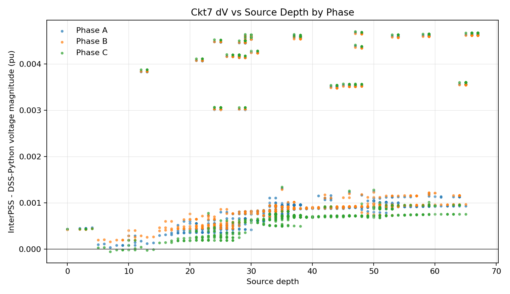

The Ckt7 depth plot does not show a large source-depth jump like the earlier
Ckt24 transformer issue. With exact model-4 CVR behavior, the largest
voltage-magnitude residual is around `0.00471 pu`, with mixed phase behavior
and a downstream worst point near `x_1001665`.

### IEEE8500 Controls-Off Voltage Comparison

After the center-tap no-load admittance fix, the worst voltage magnitude
mismatch moved to a phase-A low-voltage path around `l3312692`.

| Rank | Bus phase | InterPSS | DSS-Python | dV pu | dAngle deg |
|---:|---|---:|---:|---:|---:|
| 1 | `l3312692.1` | `0.822895504` | `0.827302562` | `-0.004407057` | `0.136911` |
| 2 | `m3016088.1` | `0.822906921` | `0.827313762` | `-0.004406841` | `0.136901` |
| 3 | `l3082993.1` | `0.822921840` | `0.827328397` | `-0.004406558` | `0.136889` |
| 4 | `l3177894.1` | `0.822966893` | `0.827372597` | `-0.004405704` | `0.136852` |
| 5 | `l2989571.1` | `0.823138692` | `0.827541131` | `-0.004402439` | `0.136710` |

Before the no-load admittance fix, the worst IEEE8500 controls-off mismatch was
about `0.0083 pu`. The fix reduced this to about `0.0044 pu`.

### Service Transformer Aggregate

Before the fix, DSS-Python versus InterPSS branch aggregation showed the
dominant mismatch in service transformers:

| Category | Count | Main finding |
|---|---:|---|
| Service transformers | 1177 | InterPSS was missing about `49 kW` and `122 kvar` aggregate service-transformer loss. |

After the fix:

| Category | Count | Aggregate mismatch after fix |
|---|---:|---|
| Service transformers | 1177 | About `+0.2 kW`, `-9.4 kvar`. |

Finding:

- Center-tap service transformers are no longer the dominant mismatch source.
- The remaining mismatch is now upstream and path-distributed.

### Low-Voltage Load Fallback Mini Cases

Two DSS-Python-backed mini cases were added:

- `CenterTapMiniLowVoltageTwoPhaseLoad`
- `CenterTapMiniLowVoltageSinglePhaseLoads`

Purpose:

- Exercise OpenDSS below-`Vminpu` behavior for low-voltage center-tap services.
- Confirm that the InterPSS fallback behavior is close for split-phase
  secondary voltage around `0.816 pu`.

Result:

- Both mini cases pass against DSS-Python references.
- This rules out the basic OpenDSS `Vminpu` constant-impedance fallback formula
  as the primary IEEE8500 mismatch source.

## Yprim Findings

DSS-Python Yprim was compared against InterPSS physical branch admittance for
the current suspect path.

Sampled lines:

- `ln6504020-2`
- `ln6504018-1`
- `ln6318761-1`
- `ln6492183-1`
- `ln6492184-2`

Finding:

- The sampled line Yprim blocks match DSS-Python numerically.
- This does not support main-feeder line geometry or linecode conversion as the
  remaining dominant source, at least for the sampled high-impact path elements.

Substation transformer:

- `hvmv_sub` physical Yprim also matches DSS-Python.
- Its branch voltage-drop mismatch is therefore more likely inherited from
  different solved currents or surrounding model differences than caused by an
  incorrect transformer admittance block.

## KCL Findings

InterPSS KCL residuals at the current suspect buses are numerical noise.

| Bus | Max residual scale |
|---|---:|
| `hvmv_sub_hsb` | about `1e-5 A` |
| `regxfmr_hvmv_sub_lsb` | below `1e-4 A` |
| `m3032977` | below `5e-5 A` |
| `m3016088` | about `3e-5 A` |
| `l3312692` | about `3e-5 A` |

Finding:

- InterPSS is internally satisfying KCL at these locations.
- The remaining mismatch is not an internal branch-current summation or current
  balance failure.

## KVL Findings

The source-to-`l3312692` phase-A KVL diagnostic was run with a `5e-5 pu`
voltage-drop-difference reporting threshold.

Largest path drop differences:

| Branch | Type | `|dDrop|` pu | Notes |
|---|---|---:|---|
| `hvmv_sub` | Transformer | `0.000514629` | Largest single path drop difference. |
| `ln6504018-1` | Line | `0.000114719` | Yprim matches DSS-Python. |
| `ln5623416-1` | Line | `0.000105533` | Path-distributed line drop difference. |
| `ln6167731-2` | Line | `0.000100204` | Path-distributed line drop difference. |
| `hvmv_sub_hsb` | Line/source connector | `0.000098422` | Upstream/source-side contribution. |
| `ln6504020-2` | Line | `0.000096009` | Yprim matches DSS-Python. |
| `ln6318761-1` | Line | `0.000089329` | Yprim matches DSS-Python. |

Finding:

- The voltage mismatch accumulates along a long 275-branch phase-A path.
- The largest individual KVL discrepancy is at `hvmv_sub`, but its Yprim matches
  DSS-Python.
- The downstream line drop differences appear consistent with different solved
  currents flowing through otherwise-correct line admittance blocks.

## Downstream Depth Check

The IEEE8500 topology was compiled in DSS-Python and traversed from
`sourcebus` using enabled power-delivery elements. This gives an unweighted
source-to-bus depth for each reachable bus.

Summary:

- Reachable buses: `4876`
- Maximum source depth: `277` edges
- Current worst mismatch path target `l3312692`: depth `275`

Farthest buses in the compiled topology:

| Rank | Bus | Depth |
|---:|---|---:|
| 1 | `sx3312692a` | `277` |
| 2 | `x3312692a` | `276` |
| 3 | `sx3082993a` | `275` |
| 4 | `l3312692` | `275` |
| 5 | `sx2989571a` | `275` |
| 6 | `sx3177894a` | `274` |
| 7 | `x3082993a` | `274` |
| 8 | `m3016088` | `274` |
| 9 | `x2989571a` | `274` |
| 10 | `x3177894a` | `273` |

Top voltage-mismatch bus depths:

| Bus phase | Depth | Percent of max depth | dV pu |
|---|---:|---:|---:|
| `l3312692.1` | `275` | `99.3%` | `-0.004407057` |
| `m3016088.1` | `274` | `98.9%` | `-0.004406841` |
| `l3082993.1` | `273` | `98.6%` | `-0.004406558` |
| `l3177894.1` | `272` | `98.2%` | `-0.004405704` |
| `l2989571.1` | `273` | `98.6%` | `-0.004402439` |
| `m1010003.1` | `272` | `98.2%` | `-0.004402279` |
| `m1010004.1` | `271` | `97.8%` | `-0.004402234` |
| `m1010007.1` | `270` | `97.5%` | `-0.004399576` |
| `m1010008.1` | `269` | `97.1%` | `-0.004399538` |
| `l3120504.1` | `269` | `97.1%` | `-0.004398409` |
| `m1010011.1` | `268` | `96.8%` | `-0.004398189` |
| `l3120503.1` | `269` | `97.1%` | `-0.004397241` |

Finding:

- The top 12 voltage magnitude mismatches are all within the farthest 50 buses
  by source-depth ranking.
- The worst buses are at `96.8%` to `99.3%` of the maximum topology depth.
- This supports the accumulation-effect hypothesis: the remaining mismatch is
  most visible at the downstream feeder end, not in the middle of the feeder.

Plot artifacts generated from the InterPSS voltage-depth export:

- `ipss.plugin.3phase/target/load-comparison/ieee8500-voltage-depth.csv`
- `ipss.plugin.3phase/target/load-comparison/ieee8500-dv-vs-depth.png`
- `ipss.plugin.3phase/target/load-comparison/ieee8500-signed-dv-vs-depth.png`
- `ipss.plugin.3phase/target/load-comparison/ieee8500-dv-vs-depth-by-phase.png`
- `ipss.plugin.3phase/target/load-comparison/ieee8500-signed-dv-vs-depth-by-phase.png`

Durable report images:

- `ipss.plugin.3phase/docs/md/images/ieee8500-dv-vs-depth-by-phase.png`
- `ipss.plugin.3phase/docs/md/images/ieee8500-signed-dv-vs-depth-by-phase.png`

Phase-colored absolute voltage-difference versus source depth:

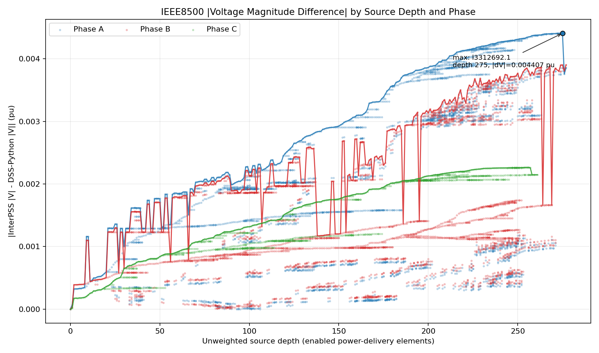

Phase-colored signed voltage-difference versus source depth:

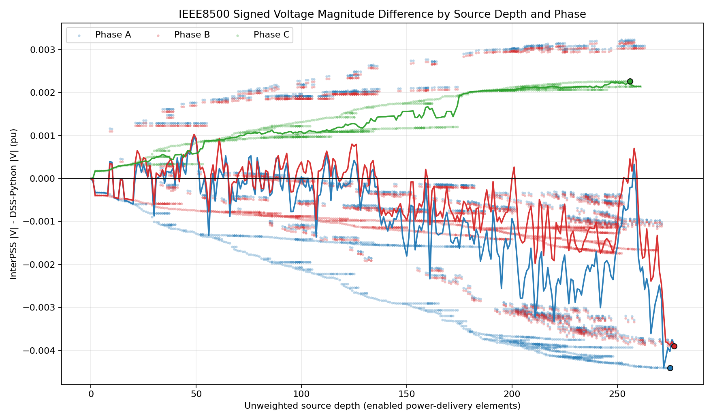

### Fixed-Point Tolerance Sensitivity

The voltage-depth export was rerun with fixed-point convergence tolerances
`1e-4`, `1e-6`, and `1e-8`.

| Fixed-point tolerance | Iterations | Max `|dV|` pu | Worst bus phase | Depth |
|---:|---:|---:|---|---:|
| `1e-4` | `15` | `0.004407057` | `l3312692.1` | `275` |
| `1e-6` | `23` | `0.004404086` | `l3312692.1` | `275` |
| `1e-8` | `31` | `0.004404402` | `l3312692.1` | `275` |

Durable tolerance-comparison images:

- `ipss.plugin.3phase/docs/md/images/ieee8500-signed-dv-vs-depth-by-phase-tolerance-comparison.png`
- `ipss.plugin.3phase/docs/md/images/ieee8500-dv-depth-envelope-tolerance-comparison.png`

Phase-colored signed voltage-difference versus source depth by tolerance:

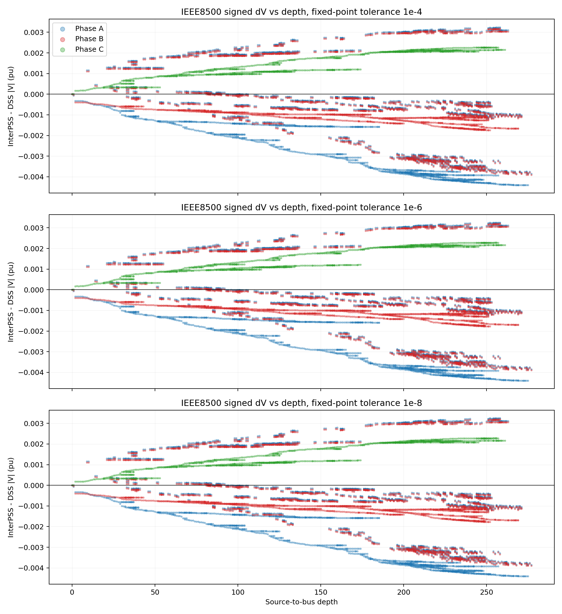

Maximum absolute voltage-difference envelope versus source depth by tolerance:

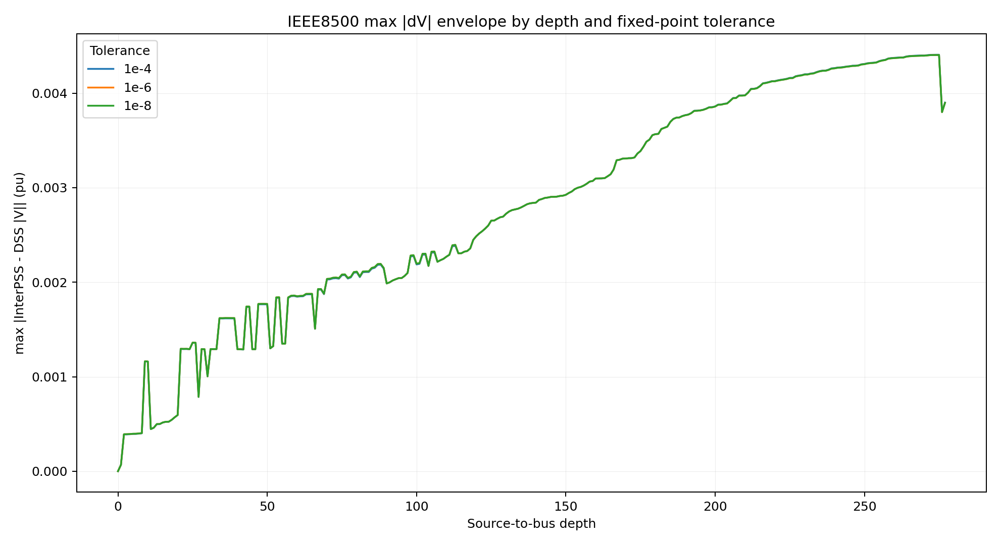

Finding:

- Tightening the fixed-point tolerance from `1e-4` to `1e-8` changes the worst
  voltage magnitude error by only about `2.7e-6 pu`.
- The worst bus and depth do not change.
- The phase-colored depth pattern is visually unchanged, so the remaining
  IEEE8500 mismatch is not a fixed-point convergence tolerance artifact.

The `|dV|` versus depth scatter shows a clear increasing envelope toward the
feeder end. The maximum point is `l3312692.1` at depth `275`, with
`|dV| = 0.004407 pu`.

Phase-colored plot summary:

| Phase | Count | Mean signed dV pu | Min dV pu | Max dV pu | Max `|dV|` location |
|---|---:|---:|---:|---:|---|
| A | `3691` | `-0.001186521` | `-0.004407057` | `0.003234970` | `l3312692.1`, depth `275` |
| B | `3624` | `-0.000578522` | `-0.003901057` | `0.003176486` | `sx3312692a.2`, depth `277` |
| C | `1216` | `0.001462627` | `0.000000077` | `0.002264603` | `l2862616.3`, depth `256` |

Interpretation:

- Phases A and B have both positive and negative signed voltage differences.
- Phase C is positive in the matched IEEE8500 reference points from this export.
- The largest downstream negative mismatch is phase A, while phase B reaches a
  similar downstream negative magnitude on the split-phase secondary endpoint.
- This argues against a single universal voltage-base or source-scaling bias.
  The remaining mismatch is phase- and path-dependent.

Additional phase-C observation:

- Phase C has `1216/1216` positive signed voltage differences in the matched
  export points.
- Phase C positivity starts immediately upstream: `hvmv_sub_hsb.3` has
  `dV = +0.000014595 pu`, while phases A/B are already negative there.
- At the regulator low side, phase C remains positive:
  `regxfmr_hvmv_sub_lsb.3 dV = +0.000175575 pu`; phases A/B are
  `-0.000323495 pu` and `-0.000389835 pu`.
- Phase C then grows monotonically by depth bands, reaching a maximum of about
  `+0.002264603 pu` at `l2862616.3`, depth `256`.

This is not random scatter. It points to a systematic phase-C path effect
introduced at or before the substation transformer/regulator boundary, then
amplified downstream.

## Capacitor State Check

The IEEE8500 OpenDSS data defines ten capacitor objects:

- Nine controlled single-phase banks:
  - `CAPBank2A`, `CAPBank2B`, `CAPBank2C`
  - `CAPBank1A`, `CAPBank1B`, `CAPBank1C`
  - `CAPBank0A`, `CAPBank0B`, `CAPBank0C`
- One three-phase bank:
  - `CAPBank3`

DSS-Python was checked with:

```text
compile Master-InterPSS.dss
set controlmode=off
solve
```

Result:

- All ten capacitor elements are enabled.
- All ten capacitor `States` are `[1]`.
- Total solved capacitor injection is about `-3745.729 kvar`.

InterPSS comparison:

| Capacitor | DSS-Python kvar | InterPSS kvar | Difference kvar |
|---|---:|---:|---:|
| `capbank0a` | `-324.118446` | `-321.888909` | `2.229537` |
| `capbank0b` | `-338.900134` | `-338.141525` | `0.758609` |
| `capbank0c` | `-421.638831` | `-423.165690` | `-1.526859` |
| `capbank1a` | `-295.573478` | `-294.839604` | `0.733873` |
| `capbank1b` | `-292.146827` | `-291.710412` | `0.436415` |
| `capbank1c` | `-318.038941` | `-318.541397` | `-0.502457` |
| `capbank2a` | `-317.018338` | `-316.700117` | `0.318222` |
| `capbank2b` | `-313.789077` | `-313.497961` | `0.291116` |
| `capbank2c` | `-323.708210` | `-323.898197` | `-0.189988` |
| `capbank3` | `-800.796616` | `-800.007599` | `0.789017` |
| **Total** | `-3745.728897` | `-3742.391410` | `3.337487` |

Finding:

- The remaining IEEE8500 controls-off mismatch is not explained by different
  initial capacitor switching states. DSS-Python and InterPSS both effectively
  have all ten capacitor banks in service.
- The aggregate capacitor kvar difference is only about `3.34 kvar`, which is
  too small to explain the remaining `0.0044 pu` voltage mismatch.
- DSS-Python `controlmode=static` also reports all capacitor `States` as `[1]`
  in this case; the total capacitor kvar changes because the solved voltage
  profile changes, not because the capacitor banks switch off.

## Current Interpretation

Confirmed:

- Center-tap service-transformer no-load and magnetizing admittance was a real
  modeling gap and has been fixed.
- The fix reduced IEEE8500 controls-off max voltage magnitude error from about
  `0.0083 pu` to about `0.0044 pu`.
- Service-transformer aggregate loss mismatch is no longer first order.
- The sampled main-feeder linecode or geometry conversion is not the dominant
  remaining source because the sampled Yprim blocks match DSS-Python.
- InterPSS KCL is clean at the suspect buses.
- Capacitor initial state under `controlmode=off` is aligned with DSS-Python;
  all ten banks are on in both tools.

Remaining likely source:

- A path-distributed solved-current difference caused by upstream or regional
  modeling differences, not by the sampled branch Y blocks themselves.

Most plausible next modeling areas:

- Aggregate load model differences by feeder region.
- Capacitor state or control simplification effects.
- Source-side and regulator-adjacent model differences.
- Remaining unsupported OpenDSS controls, especially where controls are disabled
  in one workflow but their final device states or side effects still differ.

## Recommended Next Diagnostics

1. Export and compare solved load powers/currents by feeder region.
2. Rank buses or subtrees by aggregate DSS-Python versus InterPSS load current
   difference.
3. Repeat KVL tracing on the largest load-current-difference subtrees.
4. Add toggles for load classes, capacitors, regulator taps, service
   transformers, and line shunts to isolate the remaining `0.0044 pu` path
   error.
5. Promote any isolated mismatch into a small DSS-Python-backed regression case.

## Ckt24 Cross-Check

Source case:

- OpenDSS EPRI Test Circuit 24 from
  `https://github.com/tshort/OpenDSS/tree/master/Distrib/EPRITestCircuits/ckt24`
- Local fixture: `ipss.plugin.3phase/testData/feeder/Ckt24`
- Comparison mode: `controlmode=off`
- Diagnostic master: `master_ckt24_interpss.dss`

Sanitization applied for a static InterPSS comparison:

- `model=4` CVR loads were converted to `model=1` constant-power loads.
- `AllocationFactors_Base.Txt` values were baked into the InterPSS load files
  as inline `Allocationfactor=` values.
- Yearly loadshape, monitor, and allocation-factor redirects were skipped in
  the diagnostic master.
- One asymmetric-terminal line was left disabled for this diagnostic:
  `Line.05410_93032UG` has `bus1=N292744.1.2.3` and `bus2=N292743.1.2`.

DSS-Python reference:

| Case | Controls | Converged | Iterations | Buses | Elements | Voltage rows |
|---|---|---:|---:|---:|---:|---:|
| Ckt24 sanitized static | off | yes | 4 | 6058 | 9961 | 7522 |

InterPSS result:

| Method | Result | Blocking issue |
|---|---|---|
| Fixed-point | converged | 8 iterations with the default `1.0e-9 pu` near-zero line floor; after device-level QA fixes, max voltage magnitude error is about `0.017935 pu`, max angle error about `0.313335 deg` against the DSS-Python controls-off reference |
| FBS | still fails before comparison | separate active-bus sort lookup issue after island pruning: `sort num #6057 returns null bus` |

The parser now turns off whole-bus islands that are not reachable from an
active swing bus before per-unit conversion. In the Ckt24 fixture this removes
323 buses and 322 branches from the active network. The fixed-point path also
turns off buses whose active phase nodes are only connected to floating
phase-components before building the power-flow Y-matrix; in the latest Ckt24
run this removed another 332 buses and 333 branches. With those inactive
objects excluded, the sparse Y-matrix factorization completes. OpenDSS line
branches with converted series impedance below `1.0e-9 pu` are now floored to
`1.0e-9 pu` by default; the larger `1.0e-4 pu` value is retained only as a
diagnostic sensitivity point.

The remaining iteration-0 failure around `n292357` was traced to a linecode
phase-count mismatch. `Line.05410_93062UG` is declared with
`bus1=N292360.1.2.3`, `bus2=N292357.1.2.3`, and `phases=3`, but it references
`LineCode.UG_1/0_Al_XLPE_35kV_1_Phase`, whose definition has `nphases=1`.
Before the fix, InterPSS kept only the linecode's A-phase impedance while the
branch was marked `ABC`, leaving B/C electrically underrepresented in the
local Y-matrix. The parser now expands one-phase linecode data diagonally onto
all explicitly listed bus phases for multi-phase line records. With that
normalization, Ckt24 fixed-point converges in 10 iterations and writes
`target/load-comparison/ckt24-voltage-depth.csv`.

The voltage-depth plot shows two separate effects:

- With a `1.0e-4 pu` near-zero line floor, voltage magnitude
  differences are depth-correlated and mostly negative. InterPSS voltages are
  lower than DSS-Python downstream, especially on phase A. The floor sensitivity
  sweep shows this is mostly an artificial busbar/switch drop.
- With the default `1.0e-9 pu` floor, the behavior is effectively the same as
  the zero-floor run: the broad negative depth ramp disappears, and the
  residual becomes a small positive bias with localized secondary/service
  spikes.

Corrected zero-floor Ckt24 comparison:

| Floor pu | Converged | Iterations | Max `|V|` error pu | Worst `|V|` node | Max angle error deg | Worst angle node |
|---:|---|---:|---:|---|---:|---|
| `1.0e-4` | yes | 10 | `0.050163` | `g2002af2300_n284383_sec_6.1` | `4.079674` | `g2101bc7200_n283931_sec_4.1` |
| `1.0e-5` | yes | 8 | `0.032062` | `g2100nj7400_n300463_sec_1.1` | `1.104218` | `g2101ja6700_n1321243_sec_1.1` |
| `1.0e-6` | yes | 8 | `0.032533` | `g2100nj7400_n300463_sec_1.1` | `1.124850` | `g2101ja6700_n1321243_sec_1.1` |
| `1.0e-8` | yes | 8 | `0.032564` | `g2100nj7400_n300463_sec_1.1` | `1.125051` | `g2101ja6700_n1321243_sec_1.1` |
| `0.0` | yes | 8 | `0.032564` | `g2100nj7400_n300463_sec_1.1` | `1.125052` | `g2101ja6700_n1321243_sec_1.1` |

Corrected zero-floor phase summary from
`target/load-comparison/ckt24-voltage-depth-floor-0.csv`:

| Phase | Mean signed dV pu | Min dV pu | Max dV pu | Worst node | Depth | Worst abs dV pu |
|---|---:|---:|---:|---|---:|---:|
| A | `0.006600` | `0.001848` | `0.032564` | `g2100nj7400_n300463_sec_1.1` | 98 | `0.032564` |
| B | `0.006179` | `0.001734` | `0.022638` | `g2101tc2600_n312625_sec_1.2` | 119 | `0.022638` |
| C | `0.005460` | `0.001739` | `0.024950` | `g2001ve0100_n284048_sec_2.3` | 130 | `0.024950` |

Plot artifacts:

- 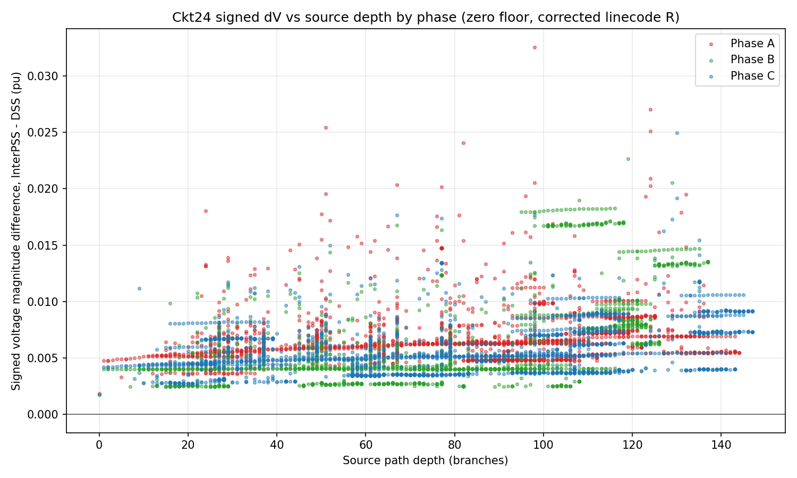
- 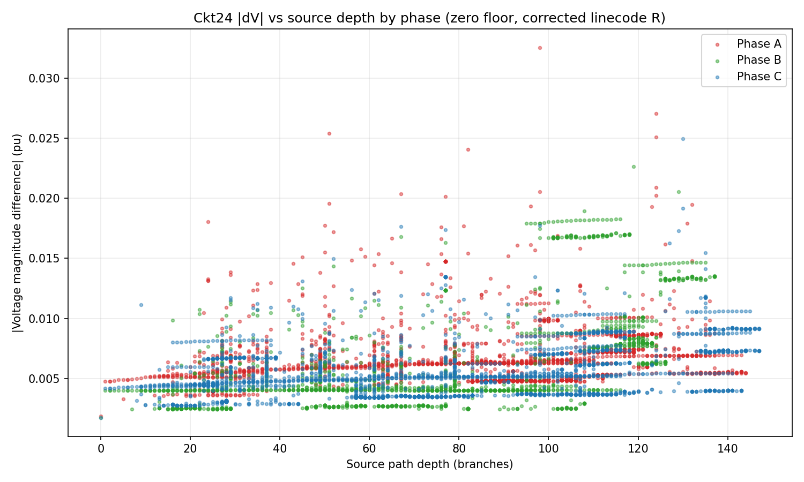

The earlier largest zero-floor mismatch was local to a secondary service
branch, not the primary feeder path. On the source path to
`g2100nj7400_n300463_sec_1.1`, the primary bus `n300463.1` is only
`0.006288 pu` high. The service transformer secondary bus
`g2100nj7400_n300463_sec.1` is `0.006620 pu` high. The final 150 ft secondary
service branch `g2100nj7400_n300463_sec_1` then leaves the load bus
`0.032564 pu` high. The branch is connected to a large single-phase load
(`xfkVA=52.02`, `Allocationfactor=1.1102`) behind a 25 kVA transformer and now
has corrected parsed impedance `z_aa=(0.047889, 0.010290) pu`.

Root cause fixed in the parser: several Ckt24 linecodes define `rmatrix=[...]`
on the `New Linecode...` header line, while the parser only captured
`rmatrix` continuation lines. This made service-line resistance zero. The
parser now reads header-line `rmatrix` values and preserves OpenDSS
`Neutral=... Kron=yes` metadata.

Device-level QA then found two additional Ckt24 modeling gaps:

- Triplex/service linecode units: the `2/0_2/0` and related triplex linecodes
  put `units=kft` on the same continuation line as `cmatrix=[...]`. InterPSS
  skipped the unit because the parser treated `cmatrix` and `units` as mutually
  exclusive. This made a 150 ft service line use a feet-to-mile factor instead
  of feet-to-kft. DSS-Python reports `LineCode.2/0_2/0` after reduction as
  `R=0.203485710677 ohm/kft`, `X=0.068094029003 ohm/kft`.
- Repeated OpenDSS Kron reduction: Ckt24 triplex linecodes intentionally repeat
  `Neutral=2 Kron=yes`. DSS reduces the original 3-conductor matrix twice,
  leaving a one-conductor service-line impedance. InterPSS now records the
  number of `Kron=yes` requests and applies sequential Kron reduction before
  mapping one-phase services onto phase A/B/C.
- Missing-kW load defaults: loads such as `Load.440273200` have `xfkVA=0`,
  no explicit `kW`, and `pf=0.98`. DSS-Python still solves them as the OpenDSS
  default `10 kW` load with about `2.0305866 kvar`; InterPSS previously parsed
  them as zero. The load parser now applies the default only when `kW` is
  absent, preserving explicit `kW=0`.

After these fixes, the Ckt24 residual is no longer a secondary/service spike.
The next device-level QA pass traced that residual to
`Transformer.step_05410_G2101CD0200`, a one-phase step transformer between
`n284017.2` and `n284017_lo.2`. The source-path diagnostic showed the phase-B
error jumping from about `0.003716 pu` at `n284017.2` to about `0.017618 pu`
at `n284017_lo.2`.

Root cause fixed in the parser: normal two-winding transformers parsed the
OpenDSS `%rs=(...)` array but did not add the two winding resistance
percentages into the series impedance. This made the step transformer
lossless in InterPSS. DSS-Python reports about `6.58 kW` real loss across the
device; InterPSS previously reported zero. After the fix,
`step_05410_g2101cd0200` parses as
`z_bb=(0.009460804169, 0.040596360746) pu`.

After this fix, the former phase-B lateral is no longer the worst region:

| Metric | Value |
|---|---:|
| Fixed-point iterations | `8` |
| Max `|V|` error | `0.004969 pu` at `n284244.1` |
| Max angle error | `0.313335 deg` at `sourcebus.3` |

Top voltage-magnitude residuals after the `%rs` fix are all below `0.005 pu`:

| Bus phase | Depth | InterPSS | DSS-Python | dV pu |
|---|---:|---:|---:|---:|
| `n284244.1` | `120` | `1.002980524` | `0.998011183` | `0.004969340` |
| `n284234.1` | `119` | `1.003024428` | `0.998055641` | `0.004968788` |
| `n284219.1` | `118` | `1.003076897` | `0.998108990` | `0.004967907` |
| `n284212.1` | `117` | `1.003118540` | `0.998151334` | `0.004967206` |

Phase-colored Ckt24 `dV` versus source-depth plots after the `%rs` fix:

- 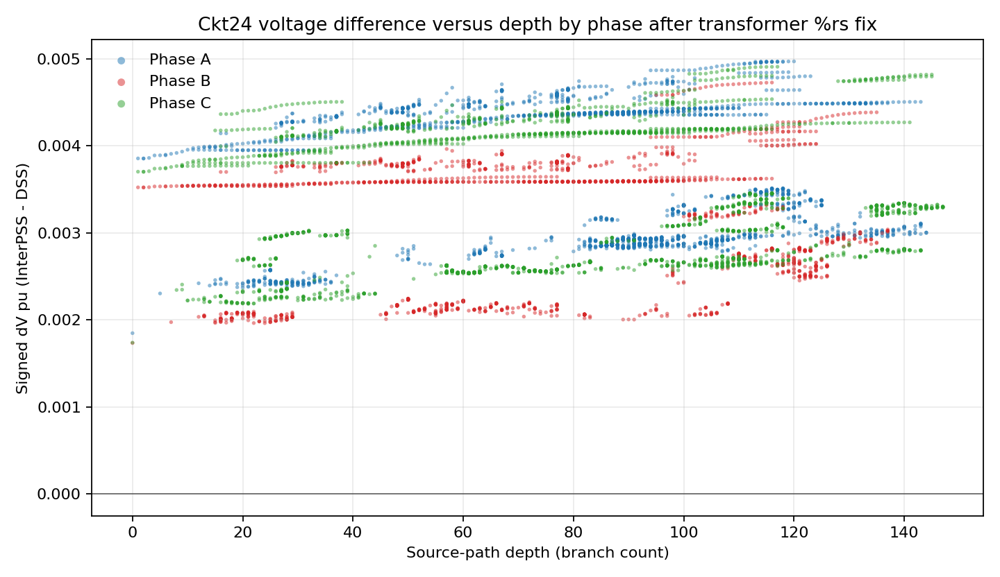
- 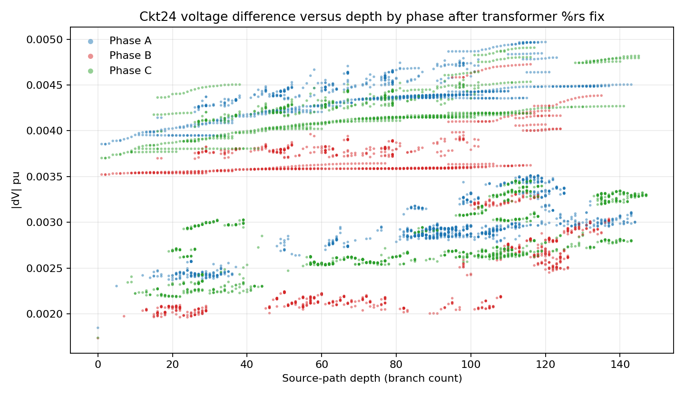

Phase comparison after the `%rs` fix:

| Phase | Count | Mean signed dV pu | Min dV pu | Max dV pu | Worst node | Depth | Worst abs dV pu |
|---|---:|---:|---:|---:|---|---:|---:|
| A | `2480` | `0.003563472` | `0.001847914` | `0.004969340` | `n284244.1` | `120` | `0.004969340` |
| B | `1752` | `0.003123854` | `0.001734277` | `0.004726480` | `n284034.2` | `116` | `0.004726480` |
| C | `2928` | `0.003281405` | `0.001739009` | `0.004907824` | `n283892.3` | `117` | `0.004907824` |

The signed plot is now all positive across phases, but the phase spread is
small. Phase A has the largest point (`0.004969 pu`), phase C is close
(`0.004908 pu`), and phase B is slightly lower (`0.004726 pu`). The previous
phase-B step-transformer discontinuity is gone; the remaining trend is a broad
source/reference offset plus modest downstream accumulation rather than a
single phase-specific device spike.

### Ckt24 Source Thevenin Impedance Fix

The depth plot showed a large mismatch at depth `0`, before any feeder path
could accumulate voltage drop. This pointed to the OpenDSS circuit source rather
than downstream line geometry. Ckt24 defines:

```text
New Circuit.ckt24 bus1=SourceBus pu=1.05 basekV=230 R1=0.63 X1=6.72 R0=4.07 X0=15.55
```

DSS-Python treats the named `SourceBus` as the terminal after the `Vsource`
Thevenin impedance, so it solves near `1.0482 pu`, not the ideal `1.05 pu`.
InterPSS previously pinned `sourcebus` directly as the swing bus, which created
a false source/reference offset of about `0.0017-0.0018 pu`.

Parser correction: `OpenDSSDataParser` now parses `R1/X1/R0/X0`, creates an
internal ideal swing bus (`sourcebus_vsource`), and connects it to the OpenDSS
`bus1` through a three-phase source branch. The source branch uses the standard
sequence-to-phase conversion:

- phase self impedance: `(Z0 + 2*Z1) / 3`
- phase mutual impedance: `(Z0 - Z1) / 3`

After the fix, Ckt24 fixed-point still converges in `8` iterations and the
comparison improves:

| Metric | Before source fix | After source fix |
|---|---:|---:|
| Max `|V|` error | `0.004969 pu` at `n284244.1` | `0.002934 pu` at `n283892.3` |
| Max angle error | `0.313335 deg` at `sourcebus.3` | `0.331505 deg` at `g2100bk4500_n283756_sec.2` |
| Depth-0 sourcebus `|dV|` | about `0.0017-0.0018 pu` | about `0.00009-0.00010 pu` |

Top voltage-magnitude residuals after the source Thevenin fix:

| Bus phase | Depth | InterPSS | DSS-Python | dV pu |
|---|---:|---:|---:|---:|
| `n283892.3` | `118` | `1.006362993` | `1.003429063` | `0.002933930` |
| `n283917.3` | `117` | `1.006403478` | `1.003470172` | `0.002933306` |
| `n283932.3` | `116` | `1.006469253` | `1.003536704` | `0.002932549` |
| `n283924.3` | `115` | `1.006523946` | `1.003592030` | `0.002931917` |

Source and substation transformer head residuals after the source fix:

| Bus phase | Depth | InterPSS | DSS-Python | dV pu |
|---|---:|---:|---:|---:|
| `sourcebus.1` | `0` | `1.048055814` | `1.048152086` | `-0.000096272` |
| `sourcebus.2` | `0` | `1.048168815` | `1.048265723` | `-0.000096908` |
| `sourcebus.3` | `0` | `1.048171986` | `1.048260991` | `-0.000089005` |
| `subxfmr_lsb.1` | `2` | `1.029876458` | `1.028048526` | `0.001827932` |
| `subxfmr_lsb.2` | `2` | `1.030244132` | `1.028744582` | `0.001499550` |
| `subxfmr_lsb.3` | `2` | `1.031380586` | `1.029575565` | `0.001805021` |

The remaining visible jump is now across or immediately after `SubXFMR`, not at
the source terminal. That makes the substation transformer model the next
highest-value Ckt24 device-level QA target.

Phase-colored Ckt24 `dV` versus source-depth plots after the source Thevenin
fix:

- 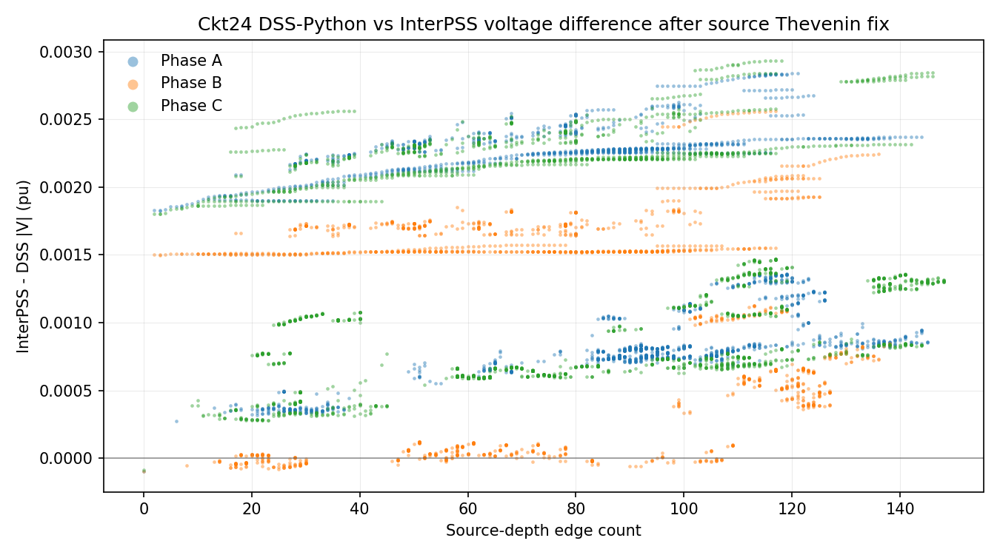
- 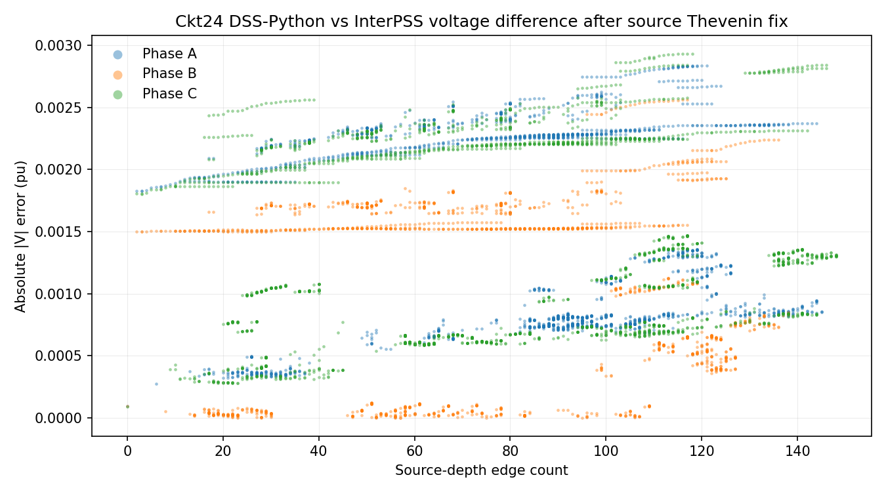

Phase comparison after the source Thevenin fix:

| Phase | Count | Mean signed dV pu | Min dV pu | Max dV pu | Worst node | Depth | Worst abs dV pu |
|---|---:|---:|---:|---:|---|---:|---:|
| A | `2480` | `0.001448429` | `-0.000096272` | `0.002837814` | `n284244.1` | `121` | `0.002837814` |
| B | `1752` | `0.001032301` | `-0.000096908` | `0.002561669` | `n284034.2` | `117` | `0.002561669` |
| C | `2928` | `0.001329945` | `-0.000089005` | `0.002933930` | `n283892.3` | `118` | `0.002933930` |

Post-prune Y audit:

| Metric | Value |
|---|---:|
| Buses | 6058 |
| Branches | 6064 |
| Active transformers | 780 |
| Phase components | 8 |
| Floating components | 7 |
| Loaded floating components | 7 |
| Weak diagonal components | 0 |

In the historical `1.0e-4 pu` line-impedance-floor diagnostic, the largest
source-connected branch admittances are no longer the original busbar/switch
branches at `2.38e8 pu`. The largest audited line admittances in that
diagnostic are about `1.4e4 pu`:

| Branch | From | To | `zAbs` pu | `yff` pu |
|---|---|---|---:|---:|
| `05410_16847025oh` | `n300597` | `n300600` | `1.0e-4` | `1.4271e4` |
| `05410_339752oh` | `n300597` | `n300595` | `1.0e-4` | `1.3722e4` |
| `05410_339786oh` | `n292547` | `n292537` | `1.0e-4` | `1.3492e4` |
| `05410_339824oh` | `n292558` | `n292557` | `1.0e-4` | `1.3492e4` |

Current interpretation:

- Ckt24 now provides an independent voltage-depth trend CSV from the InterPSS
  fixed-point result.
- The first fixed-point blocker is not a DSS-Python convergence issue; DSS-Python
  converges the sanitized static case.
- The disconnected whole-bus island blocker is now pruned at import time, and
  phase-floating buses are pruned before the fixed-point Y-matrix is built.
- The iteration-0 invalid-voltage blocker was a parser modeling issue for
  multi-phase line records that reference one-phase linecodes.
- `LineCode.Busbar` scaling appears internally consistent:
  `0.005 ohm/kft * 0.001 kft = 5e-6 ohm`, which is about `4.2e-9 pu` at
  34.5 kV on a 1 MVA base. The issue is therefore not a simple `ft` versus
  `kft` conversion error.
- The later Ckt24 comparison no longer points to busbar/switch treatment as
  the dominant residual. Device QA found and fixed service-line unit/Kron
  handling, missing-`kW` load defaults, and two-winding transformer `%rs`
  series resistance parsing. The controls-off fixed-point comparison now has
  max voltage error about `0.004969 pu`.

## Related Commit

The center-tap no-load admittance fix and diagnostics were committed as:

```text
feca4099 fix: model center-tap transformer no-load admittance
```
