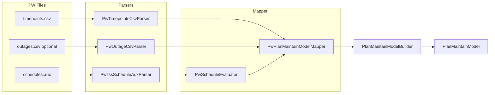

# PowerWorld TSS → PlanMaintainModel Java Adapter

## Goal

Implement the reverse of the export documented in [`plan-maintain-to-powerworld-tss.md`](ipss-plugin/ipss.plugin.core/docs/data_fmt/plan-maintain-to-powerworld-tss.md): load PowerWorld TSS **text** files and produce `com.interpss.algo.fstate.plan.model.PlanMaintainModel`.

**In scope inputs** (from [`testData/powerworld/ieee39/`](ipss-plugin/ipss.plugin.core/testData/powerworld/ieee39/)):

| File | Required | Purpose |
|---|---|---|
| `*_schedules.aux` | Yes | `TSSchedule` + `SchedPoint` (gen/load MW, branch OPEN/CLOSED) |
| `*_timepoints.csv` | Yes | Horizon: count, start time, 15-min interval |
| `*_outages.csv` | Optional | Alternate source for `originalMaintainEquipemnts` |

**Out of scope** (not needed to build `PlanMaintainModel`):

- `IEEE39bus_v30_labeled.aux` (labels already encoded in schedule names)
- Binary `.tsb` (proprietary; use CSV for horizon)
- `*_run.aux` SCRIPT

## Target API

New package: `org.interpss.plugin.fstate.pw_fmt`

```java
// Entry point
public final class PowerWorldPlanMaintainAdapter {
  public static PlanMaintainModel load(Path directory) throws Exception;
  public static PlanMaintainModel load(PowerWorldTssInput input) throws Exception;
}

public record PowerWorldTssInput(
    Path schedulesAux,
    Path timepointsCsv,
    Path outagesCsv,                    // nullable
    FSPlanMaintainModelType planModelType, // default DayAhead
    Integer intervalMinutesOverride      // nullable; infer from CSV if null
) {}
```

`load(Path)` resolves conventional suffixes in a directory (`*_schedules.aux`, `*_timepoints.csv`, `*_outages.csv`) — same naming as the IEEE39 fixture.

Build via existing [`PlanMaintainModelBuilder`](ipss-core/ipss.core_EMF/src/main/java/com/interpss/algo/fstate/plan/PlanMaintainModelBuilder.java):

```java
new PlanMaintainModelBuilder()
    .numTimePoints(horizon.count)
    .planStartDate(horizon.start)
    .planModelType(FSPlanMaintainModelType.DayAhead)
    .timePointIntervalMin(horizon.intervalMin)
    .equipmentMaintainRecs(maintainRecs)
    .timePoints(timePointRecArray)
    .build();
```

## Architecture



### 1. AUX parser with SUBDATA support

[`AuxContingencyParser`](ipss-plugin/ipss.plugin.core/src/main/java/org/interpss/plugin/contingency/aux_fmt/parser/AuxContingencyParser.java) handles concise `OBJECT (fields) { rows }` blocks but **not** `<SUBDATA SchedPoint> ... </SUBDATA>`. The schedules file requires SUBDATA parsing:

```4:15:ipss-plugin/ipss.plugin.core/testData/powerworld/ieee39/ieee39_dayahead_plan_schedules.aux
TSSchedule (ScheduleName, ValueType, ...)
{
  "Sched_Gen_Bus31-G1" "Numeric" ...
  <SUBDATA SchedPoint>
    06/27/2026 12:00:00 AM 0 572.834900 NO "" ""
  </SUBDATA>,
  ...
}
```

**`PwTssScheduleAuxParser`** returns:

- `List<PwTssSchedule>` — name, valueType (`Numeric` / `Yes/No`), `List<PwSchedPoint>`
- `List<PwTssScheduleSub>` — objectType, objectIdentifier, scheduleName (for cross-check)

**`PwSchedPoint`**: `LocalDateTime time`, `int pointType` (0=numeric MW, 1=boolean), `double nValue`, `String bValue` (`CLOSED`/`OPEN`)

Reuse tokenization logic from `AuxContingencyParser` (copy static `tokenize`/`stripComment` into a small package-private `AuxParseUtil` under `org.interpss.plugin.aux_fmt.util` to avoid touching contingency tests).

### 2. Timepoints CSV parser

**`PwTimepointsCsvParser`** reads `Index,ISO8601,DisplayTime,SolutionType`:

- `count` = data rows
- `start` = `ISO8601` of index 0
- `intervalMin` = minutes between index 0 and 1 (default 15)
- `List<LocalDateTime> times` for schedule evaluation alignment

### 3. Schedule evaluator

**`PwScheduleEvaluator`** — step-hold evaluation at each horizon timestamp:

- Sort points by time; for time `t`, use last point with `point.time <= t`
- `PointType 0` → MW (`nValue`)
- `PointType 1` → `OPEN` = outage / `CLOSED` = in-service

For single-point numeric schedules with `ApplyAsEvents=NO` (current IEEE39 fixture), all 96 points get the same MW — correct for the exported PW files.

### 4. Mapper to PlanMaintainModel beans

**`PwPlanMaintainModelMapper`**:

| PW schedule name pattern | `PlanMaintainModel` field |
|---|---|
| `Sched_Gen_{id}` | `TimePointRec[i].genMap.get(id).p` |
| `Sched_Load_{id}` | `TimePointRec[i].loadMap.get(id).p` |
| `Sched_Maint_{branch}` OPEN intervals | `EquipmentMaintainRec` |

**`TimePointRec` construction** (per index `i`):

- `timePoint` = `i`, `timePointName` = `T{i:02d}` (match JSON convention)
- For each gen/load schedule: `TPointPowerRec` with `status=true`, `p=evaluated MW`, `dp=0`

**`EquipmentMaintainRec` construction** (maintenance):

- **Primary**: derive from `Sched_Maint_*` boolean schedules — each `OPEN` segment → one record:
  - `name` = branch label (strip `Sched_Maint_` prefix)
  - `equipType` = `MPlanEquipmentType.Acline`
  - `planState` = `EquipmentMaintainPlanState.Inactive`
  - `changeState` = `true`, `simuStatus` = `true`
  - `maintainType` = `EquipmentMaintainPlanType.PlannedMaintain`
  - `startTime` / `endTime` = OPEN transition / next CLOSED transition
- **Fallback** (if no maint schedules): parse [`ieee39_dayahead_plan_outages.csv`](ipss-plugin/ipss.plugin.core/testData/powerworld/ieee39/ieee39_dayahead_plan_outages.csv) (`BranchLabel`, `StartTime`, `EndTime`)

Use `TSScheduleSub.ObjectIdentifier` to validate schedule-name ↔ device mapping when subscriptions are present (warn on mismatch, do not fail).

**Date parsing**: support PW display formats in fixture (`MM/dd/yyyy hh:mm:ss a` and `MM/dd/yyyy HH:mm` from outages CSV).

### 5. Public adapter

**`PowerWorldPlanMaintainAdapter`** orchestrates parse → map → `PlanMaintainModelBuilder.build()`.

## Tests

New test class: [`ipss.plugin.core/src/test/java/org/interpss/plugin/fstate/pw_fmt/PowerWorldPlanMaintainAdapterTest.java`](ipss-plugin/ipss.plugin.core/src/test/java/org/interpss/plugin/fstate/pw_fmt/PowerWorldPlanMaintainAdapterTest.java)

Load fixture directory: `testData/powerworld/ieee39/`

Assertions (aligned with **PW export semantics**, not full JSON at every time point):

- `planModelType` = `DayAhead`, `numsOfTotalTimePoints` = 96, interval = 15 min
- `point2TimeMap.get(0)` = `2026-06-27T00:00`, `get(95)` = start + 95×15 min
- `originalMaintainEquipemnts.size()` = 2 with correct names, `Inactive`, windows 08:00–11:00 and 14:00–16:00
- T0: `Bus31-G1` p ≈ 572.8349, `Bus39-L1` p ≈ 1104.0
- T1/T2: same MW as T0 (flat schedules in current PW artifact)
- Parser unit tests for SUBDATA block extraction (golden snippet from `ieee39_dayahead_plan_schedules.aux`)

**Important limitation to document**: the checked-in JSON fixture [`ieee39_dayahead_plan_maintain_plan.json`](ipss-plugin/ipss.plugin.core/testData/psse/v30/ieee39_dayahead_plan_maintain_plan.json) has **time-varying** gen/load MW (T1/T2 differ from T0), but the PW schedules AUX was exported with **flat T0 MW only**. The adapter faithfully loads what's in PW files; full JSON equality requires multi-point `SchedPoint` rows in the AUX (future export enhancement).

Pattern reference: [`DayaheadMaintainPlanTest`](ipss-core/ipss.test.core/src/test/java/com/interpss/test/fstate/plan/DayaheadMaintainPlanTest.java) for assertion style.

## Documentation update

Add **“Reverse mapping (Java adapter)”** section to [`plan-maintain-to-powerworld-tss.md`](ipss-plugin/ipss.plugin.core/docs/data_fmt/plan-maintain-to-powerworld-tss.md):

- Input file table
- `PowerWorldPlanMaintainAdapter.load(...)` usage example
- Reverse field mapping table
- Flat-MW vs multi-point schedule note

## Optional follow-up (not in initial PR)

- Sample in [`FSPluginDclfAlgoRunSample.java`](ipss-plugin/ipss.plugin.core/src/sample/java/org/interpss/fstate/FSPluginDclfAlgoRunSample.java) loading PW files instead of JSON
- Extend `generate_ieee39_dayahead_pw_tss.py` to emit per-time-point `SchedPoint` rows for true JSON round-trip

## Build verification

```bash
cd ipss-plugin
mvn -pl ipss.plugin.core test -Dtest=PowerWorldPlanMaintainAdapterTest
```
