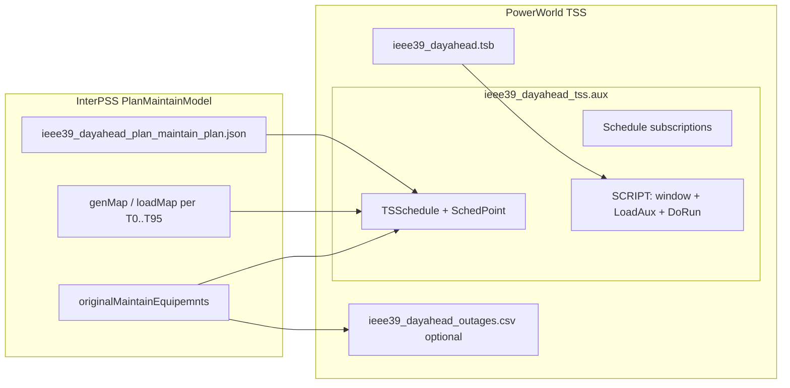

# Port IEEE39 Day-Ahead Plan to PowerWorld TSS AUX

## Source and target

**Source model** — [`ieee39_dayahead_plan_maintain_plan.json`](ipss-plugin/ipss.plugin.core/testData/psse/v30/ieee39_dayahead_plan_maintain_plan.json) (`PlanMaintainModel` JSON):

| Field | Value |
|---|---|
| Horizon | 96 points, 15-min (`timePointIntervalMin: 15`) |
| Start | `2026-06-27T00:00:00` |
| Gens | 10 units (`Bus31-G1` … `Bus39-G1`), MW in `genMap` |
| Loads | 19 units (`Bus15-L1` …), MW in `loadMap` |
| Maintenance | 2 ACLine outages from [`Ieee39_Dayahead_Info`](ipss-core/ipss.test.core/src/main/java/sample/fstate/Ieee39_Dayahead_Info.java): `Bus29_to_Bus26_cirId_1` (08:00–11:00), `Bus26_to_Bus25_cirId_1` (14:00–16:00) |

**PowerWorld concepts** (per [Auxiliary File Format PDF](https://www.powerworld.com/WebHelp/Content/Other_Documents/Auxiliary-File-Format.pdf) and [Setting up Scheduled Input Data](https://www.powerworld.com/WebHelp/Content/MainDocumentation_HTML/Setting_up_Scheduled_Input_Data.htm)):

- **Time-point list** — 96 TSS time points (`.tsb` or script-loaded PWW)
- **Scheduled input** — `TSSchedule` DATA blocks with `SchedPoint` subdata (numeric for MW, boolean for line/gen status)
- **Schedule subscriptions** — bind schedules to `Gen` MW, `Load` MW, `Branch` LineStatus fields
- **Scheduled Actions** (add-on) — optional outage switching via `ImportData(..., PWCSV)` + `ApplyScheduledActionsAt` script commands



## Prerequisite: labeled IEEE39 base AUX

You chose **label/ObjectID** references (not raw bus numbers). There is no labeled IEEE39 PowerWorld case in the repo today (unlike [`Texas7k_20210804_labeled_aux_contingencies_100.aux`](ipss-plugin/ipss.plugin.core/testData/powerworld/texas7k/Texas7k_20210804_labeled_aux_contingencies_100.aux)).

Create a one-time labeled base file:

- **Output**: [`testData/powerworld/ieee39/IEEE39bus_v30_labeled.aux`](ipss-plugin/ipss.plugin.core/testData/powerworld/ieee39/IEEE39bus_v30_labeled.aux)
- **Method**: Import [`IEEE39bus_v30.raw`](ipss-plugin/ipss.plugin.core/testData/psse/v30/IEEE39bus_v30.raw) into PowerWorld, set **Label** (or ObjectID in concise format) on each `Gen`, `Load`, and `Branch` to match JSON keys (`Bus31-G1`, `Bus15-L1`, `Bus29_to_Bus26_cirId_1`, …), then `SaveData` export.
- **Reference pattern** from existing contingency AUX: `BRANCH 'Bus29_to_Bus26_cirId_1'`, `GEN 'Bus39-G1'`, `LOAD 'Bus15-L1'` (same style as `BRANCH 'line_...'` in Texas7k).

This file is loaded **before** the schedule AUX when running in Simulator.

## Deliverable 1: TSS time-point file (`.tsb`)

**Output**: [`testData/powerworld/ieee39/ieee39_dayahead_plan.tsb`](ipss-plugin/ipss.plugin.core/testData/powerworld/ieee39/ieee39_dayahead_plan.tsb)

- 96 time points from `2026-06-27T00:00:00` to `2026-06-27T23:45:00`, 15-minute spacing
- Solution type: `Single Solution` (matches InterPSS DCLF/ACLF day-ahead use in [`FSPluginDclfAlgoRunSample`](ipss-plugin/ipss.plugin.core/src/sample/java/org/interpss/fstate/FSPluginDclfAlgoRunSample.java))

**How to produce**: Configure TSS in PowerWorld with the 96-point window, then `TimeStepSaveTSB("ieee39_dayahead_plan.tsb")` once; or hand-author following a golden TSB exported from a minimal 3-bus case.

## Deliverable 2: Schedule DATA blocks (`.aux`)

**Output**: [`testData/powerworld/ieee39/ieee39_dayahead_plan_schedules.aux`](ipss-plugin/ipss.plugin.core/testData/powerworld/ieee39/ieee39_dayahead_plan_schedules.aux)

### 2a. `TSSchedule` + `SchedPoint` (gen/load MW)

Per [Auxiliary File Format — TSSchedule / SchedPoint](https://www.powerworld.com/files/Auxiliary-File-Format-21.pdf) (subdata line format: `Date Hour PointType NValue BValue TValue AValue`):

- **One schedule per gen/load** (29 schedules total), named to match labels, e.g. `Sched_Gen_Bus39-G1`
- **PointType `0` (numeric)** for MW values from `timePointRecList[0].timePointRecList[*]`
- In this fixture MW is **flat** across all 96 points — each schedule can use a **single SchedPoint** at `06/27/2026 00:00:00` with `Apply Schedule Points as Events = NO` (re-applied every timestep per [Schedule Dialog](https://www.powerworld.com/WebHelp/Content/MainDocumentation_HTML/Schedule_Dialog.htm))
- If any device MW changes between points in future plans, emit step-change SchedPoints only at change timestamps (dedupe consecutive equal values)

Example skeleton (field names to be confirmed from a golden PW export):

```text
TSSchedule (ScheduleName, ValueType, Interpolate, ApplyAsEvents, ...)
{
  "Sched_Gen_Bus39-G1" "Numeric" "NO " "NO " ...
  <SUBDATA SchedPoint>
    //Date Hour PointType NValue BValue TValue AValue
    06/27/2026 12:00:00 AM 0 1000.0 NO "" ""
  </SUBDATA>
}
```

### 2b. `TSSchedule` + `SchedPoint` (maintenance / branch status)

Map InterPSS `EquipmentMaintainRec` semantics ([`EquipMaintainInfoAclfNetHelper`](ipss-core/ipss.core_EMF/src/main/java/com/interpss/algo/fstate/plan/maintain/EquipMaintainInfoAclfNetHelper.java)):

| InterPSS | PowerWorld LineStatus schedule |
|---|---|
| `planState: Inactive` during `[startTime, endTime)` | `OPEN` (out of service) |
| Otherwise | `CLOSED` (in service) |

**Two boolean schedules** (PointType `1`):

- `Sched_Maint_Bus29_to_Bus26_cirId_1`: CLOSED until 08:00 → OPEN 08:00–11:00 → CLOSED after 11:00
- `Sched_Maint_Bus26_to_Bus25_cirId_1`: CLOSED until 14:00 → OPEN 14:00–16:00 → CLOSED after 16:00

### 2c. Schedule subscriptions

Bind schedules to labeled objects (exact object type/fields discovered from golden export — typically `TSScheduleSubscription` or concise `ObjectID` + field name):

| Subscription | Object reference | Field |
|---|---|---|
| Gen MW | `GEN 'Bus39-G1'` (etc.) | Gen MW |
| Load MW | `LOAD 'Bus15-L1'` (etc.) | Load MW |
| Line outage | `BRANCH 'Bus29_to_Bus26_cirId_1'` | Line Status |

**Discovery step (required before finalizing syntax)**: In PowerWorld, manually create one numeric schedule + one subscription + one boolean branch schedule, export via `SaveData`, and copy the exact header fields into the static file. The published PDF documents `SchedPoint` subdata but not subscription headers.

## Deliverable 3: Scheduled Actions data (maintenance)

**Output**: [`testData/powerworld/ieee39/ieee39_dayahead_plan_outages.csv`](ipss-plugin/ipss.plugin.core/testData/powerworld/ieee39/ieee39_dayahead_plan_outages.csv) (PWCSV) **or** a small companion AUX if PW export provides a native ScheduledOutage DATA block.

Wrapped in SCRIPT inside [`ieee39_dayahead_plan_run.aux`](ipss-plugin/ipss.plugin.core/testData/powerworld/ieee39/ieee39_dayahead_plan_run.aux):

```text
SCRIPT IEEE39DayAhead
{
  SetScheduleWindow("06/27/2026 00:00", "06/27/2026 23:45", 15, MINUTES);
  TimeStepLoadTSB("ieee39_dayahead_plan.tsb");
  LoadAux("IEEE39bus_v30_labeled.aux", YES);
  LoadAux("ieee39_dayahead_plan_schedules.aux", YES);
  ImportData("ieee39_dayahead_plan_outages.csv", PWCSV, 1, NO);
  ApplyScheduledActionsAt("06/27/2026 08:00", "06/27/2026 16:00", , NO);
  TimeStepDoRun("2026-06-27T00:00:00", "2026-06-27T23:45:00");
}
```

- **TSS branch-status schedules** (Deliverable 2b) are the primary maintenance mechanism for Time Step Simulation.
- **Scheduled Actions / PWCSV** provides the parallel outage-switching representation the user asked for; requires Scheduled Actions add-on in Simulator.
- Outage CSV rows derived from `originalMaintainEquipemnts`: outage name, labeled branch, start/end datetimes matching JSON.

## Deliverable 4: Mapping documentation

Add [`docs/data_fmt/plan-maintain-to-powerworld-tss.md`](ipss-plugin/ipss.plugin.core/docs/data_fmt/plan-maintain-to-powerworld-tss.md) cross-linking:

- [future-state-what-if-analysis.md](ipss-plugin/ipss.plugin.core/docs/data_fmt/future-state-what-if-analysis.md) (InterPSS future-state inputs)
- PowerWorld TSS / Schedule / Scheduled Actions help topics
- Field mapping table (JSON path → PW object/schedule)
- File load order and validation checklist

## Validation checklist (manual in PowerWorld)

1. Open IEEE39 case + load `IEEE39bus_v30_labeled.aux` — verify labels resolve (`Bus29_to_Bus26_cirId_1` etc.)
2. Run `ieee39_dayahead_plan_run.aux` — confirm 96 time points appear in TSS Summary
3. At T32 (08:00): `Bus29_to_Bus26_cirId_1` OPEN; gen/load MW match JSON T32 values
4. At T44 (11:00): line restored; at T56 (14:00): second outage active
5. Compare total gen/load MW at T0 against JSON totals (~6192 MW load, ~6092 MW gen in base period)

## Scope boundaries (per your choices)

- **In scope**: Static `.aux` / `.tsb` / `.csv` artifacts under `testData/powerworld/ieee39/`, labeled references, mapping doc
- **Out of scope**: Reusable Java converter module (deferred; follow [`aux_fmt`](ipss-plugin/ipss.plugin.core/src/main/java/org/interpss/plugin/contingency/aux_fmt/) pattern later if needed)
- **Risk**: Exact `TSSchedule` header and subscription object syntax must be taken from a PowerWorld golden export — plan includes that discovery step before checking in final schedule AUX

## File layout summary

```
ipss.plugin.core/testData/powerworld/ieee39/
  IEEE39bus_v30_labeled.aux      # prerequisite labeled base case
  ieee39_dayahead_plan.tsb       # 96 TSS time points
  ieee39_dayahead_plan_schedules.aux  # TSSchedule + subscriptions
  ieee39_dayahead_plan_outages.csv    # Scheduled Actions PWCSV
  ieee39_dayahead_plan_run.aux        # orchestration SCRIPT
ipss.plugin.core/docs/data_fmt/
  plan-maintain-to-powerworld-tss.md
```
