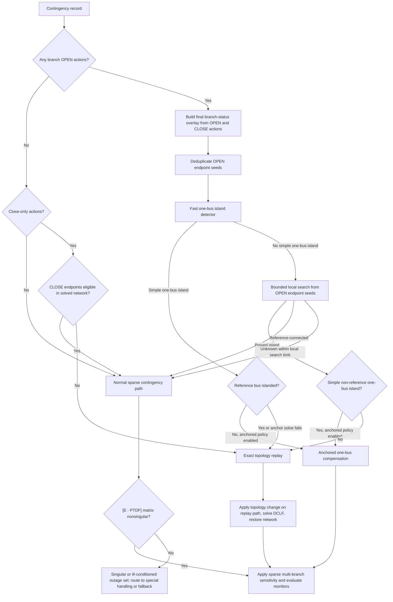

# DCLF Contingency Analysis

This document describes the runtime contingency-analysis flow used by
`ParallelDclfContingencyAnalyzer`, with emphasis on multi-line branch outages,
local islanding detection, anchored one-bus island compensation, and sparse
sensitivity routing.

The goal is to keep the normal DCLF contingency path fast while still detecting
the cases that need topology-aware handling.

## Main Entry Points

Use `ParallelDclfContingencyAnalyzer` for DCLF contingency studies. It supports
both normal branch monitoring and mixed monitoring constraints:

- branch MW limits,
- monitored interfaces,
- flowgates,
- nomogram MW facets,
- monitoring exceptions.

The default DCLF contingency solution method is `SparseEqnSolve` through
`DclfContingencyConfig`. This is also the preferred fast path for multi-branch
outages. Woodbury-style matrix update code exists, but it is not the default
for the normal contingency analyzer.

## Runtime Shape

At a high level, one analysis run performs shared setup once and then evaluates
many contingencies:

```text
build DCLF algorithm workers
solve base DCLF
compile monitored constraints
build monitor index arrays

for each contingency:
    decide normal sparse path vs topology replay path
    compute postFlowMw[]
    evaluate branch/interface/flowgate/nomogram checks
    emit result objects only for violations
```

For performance, monitoring records are compiled into array indexes before the
contingency scan. The inner loop should work mostly with primitive arrays such
as `preFlowMw[]`, `postFlowMw[]`, branch indexes, coefficients, and limits.

## Multi-Line Outage Processing

Multi-line contingencies may include multiple branch `OPEN` actions, branch
`CLOSE` actions, or a mix of both. The analyzer uses a local topology screen
before deciding whether the normal sparse sensitivity path is safe enough to
try. `OPEN` actions drive islanding risk; `CLOSE` actions are eligible for the
sparse path only when their endpoints are already valid in the solved network.



The important routing rule is that `unknown` from the local topology screen is
not treated as a proved island. It does not force exact replay by itself. The
normal sparse path is still attempted, and the existing `[E - PTDF]` singularity
check remains the algebraic guard for multi-line outage sensitivity.

## Local Topology Screen

The local topology screen is intentionally smaller than a full-network island
scan. It starts only from the endpoint buses of branch `OPEN` actions:

```text
openEndpointSeeds = unique endpoints of OPEN branches
```

The seeds are de-duplicated before search. This avoids repeated local walks
when several outage branches share a bus.

The screen applies a final branch-status overlay for the contingency:

```text
OPEN action  -> branch inactive for the screen
CLOSE action -> branch active for the screen
other branch -> current base status
```

This is only an overlay. The base network is not permanently modified during
the routing screen.

The bounded local search limit is controlled by:

```text
interpss.dclf.topology.routingLocalIslandSearchMaxBuses
```

The default is `256` buses per endpoint seed. If the search proves that an
endpoint component is disconnected from the reference-connected system within
that limit, the analyzer treats it as islanded. If the search exceeds the
limit before reaching the reference side, it returns `unknown`.

`unknown` means only:

```text
the bounded local screen did not prove either islanded or connected
```

It does not mean the contingency is safe, and it does not mean the contingency
is islanded. The next guard is the sparse sensitivity calculation and its
`[E - PTDF]` singularity check.

## E-PTDF Singularity Check

For multi-branch outage sensitivity, the outage equations use the small dense
matrix:

```text
[E - PTDF]
```

where each row and column corresponds to an outage action in the compensated
multi-branch formulation. `OPEN` and `CLOSE` actions use their action-specific
sign convention in that formulation. The analyzer must invert or solve this
matrix to calculate the combined outage response.

If `[E - PTDF]` is nonsingular, the sparse sensitivity result can be used:

```text
postFlowMw = baseFlowMw + combinedOutageShiftMw
```

If `[E - PTDF]` is singular or numerically ill-conditioned, the sensitivity
formulation cannot solve the combined outage equations. For open-only outages,
this is a strong indicator that the selected outage set changes network rank,
often because it islands a bus or radial section. In that case the contingency
should be routed to special processing or fallback handling instead of silently
using the sensitivity result.

This is why the local topology screen can be less conservative:

```text
bounded local topology unknown
    -> still try sparse sensitivity
    -> [E - PTDF] singularity check detects algebraic failure
    -> singular cases are routed to special handling or fallback
```

The topology screen is a fast routing optimization. The `[E - PTDF]` check is
the algebraic guard for the multi-line sensitivity solve.

## One-Bus Island Handling

The default islanding policy is:

```java
DclfIslandingTreatment.ANCHORED_COMPENSATE_ONE_BUS
```

For a simple non-reference one-bus island, the analyzer uses anchored
compensation:

1. Identify the island bus.
2. Select one opened incident branch as the anchor.
3. Temporarily open the other outage branches while keeping the anchor in
   service.
4. Solve the nonsingular anchored topology.
5. Remove the final anchor effect through PTDF compensation.
6. Restore all branch statuses.

This is the practical version of the "all but one boundary line" idea. Keeping
one boundary line anchors the isolated bus so the DCLF matrix remains
nonsingular. The final step then compensates the removal of that last anchor
line.

If the one-bus island contains load, generation, or both, anchored compensation
still works because the anchored DCLF solve includes the post-outage net
injection at that bus before the final anchor removal is compensated.

If the islanded bus is the reference bus, or if the anchored solve cannot be
completed, the analyzer falls back to exact topology replay.

## Larger Islands And Exact Replay

If the local topology screen proves a larger island, or if anchored
compensation is not applicable, the replay path applies the contingency
topology on the network, solves DCLF for the changed topology, collects monitor
flows, and restores the original topology.

For islanded replay, buses in the disconnected island are turned off before the
DCLF solve. If the island contains the reference bus, the analyzer selects a
replacement active reference bus outside the island before solving.

Exact replay is slower because it performs topology mutation, DCLF setup, and
post-topology solve work for that contingency. The fast routing and anchored
one-bus handling are designed to minimize how often this path is needed.

## Practical Defaults

Recommended default settings:

```java
DclfContingencyConfig config = new DclfContingencyConfig();
config.setSolutionMethod(DclfContingencySolutionMethod.SparseEqnSolve);
config.setIslandingTreatment(DclfIslandingTreatment.ANCHORED_COMPENSATE_ONE_BUS);
```

Use exact replay explicitly when a study requires full post-topology DCLF
results for every islanded contingency:

```java
config.setIslandingTreatment(DclfIslandingTreatment.FULL_DCLF_REPLAY);
```

Use `SKIP` only for studies where islanded contingencies should produce no
DCLF violation records.

## Related Documents

- `dclf-mixed-monitoring-constraints.md`: user-facing mixed monitoring API.
- `spp-effective-limits-gap-analysis.md`: flowgate, nomogram, and monitoring
  exception design background.
- `../../../docs/dclf_woodbury_update_plan.md`: historical Woodbury and
  transfer panel design notes.
