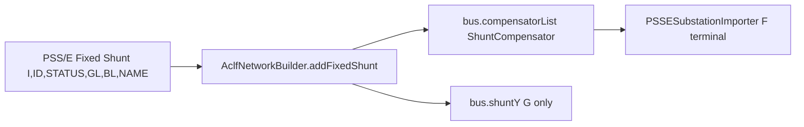

# Represent PSS/E Fixed Shunts as ShuntCompensator

## Chosen electrical mapping

LF adds **both** `compensatorList` B and `bus.shuntY` in [`AclfBusYMatrixHelper.calShuntEquivY`](ipss-core/ipss.core_EMF/src/main/java/com/interpss/core/aclf/impl/func/bus/AclfBusYMatrixHelper.java). Putting the same BL in both paths double-counts.

**Policy (IpssInternal-style for B + PSS/E GL):**
- Create one `ShuntCompensator` per fixed-shunt record on `bus.getCompensatorList()`
- `id` = PSS/E ID (`F1`, `1`, …); `name` from RAW name field; `status` from STATUS
- `type` = `CAPACITOR` if `BL >= 0`, else `INDUCTOR`
- `steps = 1`; `setB(bl / baseMva)` (LF reads `getB()`)
- Put **only GL** into `bus.shuntY`: `addToBusShuntY(busId, Complex(gl/baseMva, 0))` when status is in-service
- Offline (`STATUS=0`): still create the compensator with `status=false`; do not add G; inactive banks are skipped in capacitor B sum



## Implementation

### 1. Builder API — [`AclfNetworkBuilder.java`](ipss-plugin/ipss.plugin.core/src/main/java/org/interpss/fadapter/builder/AclfNetworkBuilder.java)

Add:

```java
public ShuntCompensator addFixedShunt(String busId, String id, boolean status,
        double gPu, double bPu, String name)
```

- `CoreObjectFactory.createShuntCompensator(id, type)` → set name/status/steps/`setB(bPu)`
- `bus.getCompensatorList().add(...)`
- If `status && gPu != 0`: `addToBusShuntY(busId, new Complex(gPu, 0))`
- Return the compensator (or null if bus missing)

Do **not** put `bPu` into `shuntY`.

### 2. RAW parser — [`PSSEDirectParser.java`](ipss-plugin/ipss.plugin.core/src/main/java/org/interpss/fadapter/psse/PSSEDirectParser.java)

In `collectFixedShunts` (runs after buses exist, **before** substation import):
- Read optional name: `rec.getString(5, "").trim()`
- Call `builder.addFixedShunt(busId, id, status==1, gl/baseMva, bl/baseMva, name)` immediately
- Drop `FixedShuntRec` list and make `parseFixedShuntSection()` a no-op (or remove the late call) so Y is not applied twice

v≤30 bus-record GL/BL stays on `setBusShuntY` (no separate ID section).

### 3. NB terminal resolve — [`PSSESubstationImporter.java`](ipss-plugin/ipss.plugin.core/src/main/java/org/interpss/fadapter/psse/PSSESubstationImporter.java)

```java
case FIXED_SHUNT:
    return bus.getCompensator(eqId);
```

Compensators must exist before substation parse (satisfied by creating them in `collectFixedShunts`).

### 4. JSON parity — [`PSSEJsonDirectParser.java`](ipss-plugin/ipss.plugin.core/src/main/java/org/interpss/fadapter/psse/PSSEJsonDirectParser.java)

Route `parseFixedShuntRow` through the same `addFixedShunt` (parse `shntid` / name if present; default id `"1"`).

### 5. Tests

Update [`PSSEDirectParser_VersionGate_Test#testV31FixedShuntAppliedToBusY`](ipss-plugin/ipss.test.plugin.core/src/test/java/org/interpss/core/adapter/psse/raw/aclf/PSSEDirectParser_VersionGate_Test.java):
- Bus203: `shuntY.real ≈ 0` (GL cancels), `shuntY.imag ≈ 0` (BL no longer in shuntY)
- Two compensators: ids `"1"` and `"2"`, `getB()` 0.30 and 0.20
- Equivalent susceptance: `bus.toCapacitorBus().getB(false) ≈ 0.50`

Add a small assertion (in that test or NB sample path) that type-`F` terminals can resolve via `getCompensator` when using `sample_nb.raw` / v31 sample.

## Out of scope

- BPA / IEEE CDF / Matpower / GE / PWD (stay on `addToBusShuntY`)
- Changing `ShuntCompensator` EMF model to hold G
- Contigency CON SHUNT actions / JSON export updater (can follow later once named objects exist)
