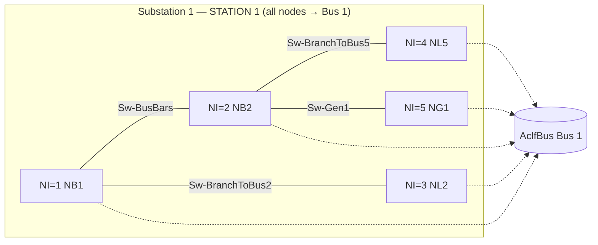
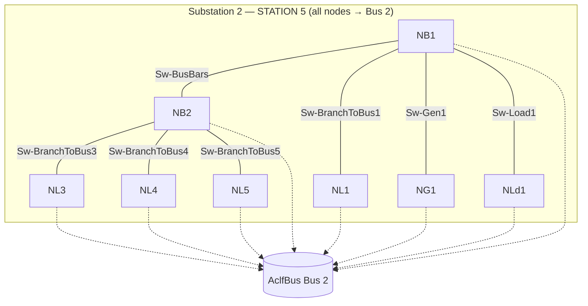
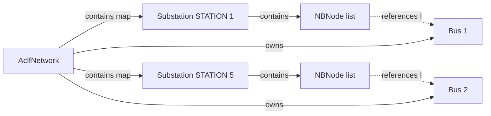

# IEEE14 Substation ↔ NBNode Containing Relationship

Walk-through of how **substations contain nodes** in the PSS®E Substation Data Group, using the fixture:

[`IEEE_14_bus_nodeBreaker_rev35_exported.raw`](../../../ipss-plugin/ipss.test.plugin.core/testData/psse/nbreaker/IEEE_14_bus_nodeBreaker_rev35_exported.raw)

(relative from `ipss-plugin`: `ipss.test.plugin.core/testData/psse/nbreaker/IEEE_14_bus_nodeBreaker_rev35_exported.raw`)

For field definitions, see [substation-data.md](substation-data.md). This note focuses on **containment and references**, not import code.

---

## Containment model

```
AclfNetwork
 └── SubstationMap
      ├── Substation "1" (STATION 1)     ← owns bus-section topology for electrical Bus 1
      │    ├── nbNodeList[]             ← contained NBNodes (unique NI within station)
      │    ├── nbSwitchList[]           ← switches between nodes in *this* station
      │    └── nbEquipConnectList[]     ← equipment terminals pinned to a node
      └── Substation "2" (STATION 5)     ← owns topology for electrical Bus 2
           ├── nbNodeList[]
           ├── nbSwitchList[]
           └── nbEquipConnectList[]
```

| Relationship | Cardinality | Meaning |
|--------------|-------------|---------|
| `Network` → `Substation` | 1 → N | Stations live on the network map (`substationMap`) |
| `Substation` → `NBNode` | 1 → N | Every node belongs to **exactly one** station (`NBNode.substation` ↔ `Substation.nbNodeList`) |
| `NBNode` → `Bus` | N → 1 | Many nodes may share one electrical bus `I` (closed switches merge them) |
| `Substation` → `Bus` | N → M | Station also collects buses it references (`sub.addBus(bus)` on first sight) |

Key rule from PSS®E: **node numbers (`NI`) are unique only inside one substation.** Station 1 node `1` and Station 5 node `1` are unrelated objects.

In InterPSS: `Substation.addNBNode(node)` sets `node.setSubstation(this)` and fills `getNbNodeList()`.

---

## What this fixture models

The RAW still has the full **14-bus bus-branch** case. Only **two** electrical buses get a node-breaker overlay:

| Substation `IS` | Name | Electrical bus `I` on all nodes | Nodes | Switches | Terminals |
|-----------------|------|----------------------------------|-------|----------|-----------|
| 1 | `STATION 1` | Bus **1** | 5 | 4 | 3 |
| 2 | `STATION 5` | Bus **2** | 8 | 7 | 6 |

Buses 3–14 have no substation block (no NB model).

All closed breakers in each station tie their nodes to the **same** bus-branch bus, so every node record in a station points at that one `I`.

---

## Station 1 — Bus 1 topology

### RAW block (abbreviated)

```
1,'STATION 1',0.0,0.0,0.1          ← substation header
1,'NB1',1,1,1.0,0.0                ← NI, NAME, I=Bus1, STATUS, VM, VA
2,'NB2',1,1,1.0,0.0
3,'NL2',1,1,1.0,0.0
4,'NL5',1,1,1.0,0.0
5,'NG1',1,1,1.0,0.0
0
… switches …
… terminals …
```

### Contained nodes → bus

| Node `NI` | Name | Role (from name) | Electrical bus |
|-----------|------|------------------|----------------|
| 1 | `NB1` | Bus bar section 1 | Bus 1 |
| 2 | `NB2` | Bus bar section 2 | Bus 1 |
| 3 | `NL2` | Line terminal toward Bus 2 | Bus 1 |
| 4 | `NL5` | Line terminal toward Bus 5 | Bus 1 |
| 5 | `NG1` | Generator terminal | Bus 1 |

### How switches connect nodes (still inside Station 1)



- **Containment (solid):** nodes and switches are children of the substation.
- **Reference (dotted):** each `NBNode.bus` points at the shared electrical bus; the bus is **not** contained by the node.

### Equipment terminals (pin equipment to a node)

| Bus | Node | Type | Equipment |
|-----|------|------|-----------|
| 1 | 5 (`NG1`) | `M` | Gen `1` on Bus 1 |
| 1 | 3 (`NL2`) | `B` | Branch 1–2 CKT `1` |
| 1 | 4 (`NL5`) | `B` | Branch 1–5 CKT `1` |

Terminals do not create a second containment tree: they are `NBEquipConnection` objects on the **same** substation, each holding a reference to one `NBNode`.

---

## Station 5 — Bus 2 topology

Same pattern: one substation contains eight nodes, all mapped to electrical **Bus 2**.

| Node `NI` | Name | Role | Electrical bus |
|-----------|------|------|----------------|
| 1 | `NB1` | Bus bar 1 | Bus 2 |
| 2 | `NB2` | Bus bar 2 | Bus 2 |
| 3 | `NL3` | Branch to Bus 3 | Bus 2 |
| 4 | `NL4` | Branch to Bus 4 | Bus 2 |
| 5 | `NL5` | Branch to Bus 5 | Bus 2 |
| 6 | `NL1` | Branch to Bus 1 | Bus 2 |
| 7 | `NG1` | Generator | Bus 2 |
| 8 | `NLd1` | Load | Bus 2 |



Terminals: gen + load on Bus 2, plus four AC branches from Bus 2 to buses 1/3/4/5 — each attached at the named line/gen/load node above.

---

## Containing vs referencing (summary)



| Link | Kind | Consequence |
|------|------|-------------|
| Substation owns NBNode | **Containment** | Deleting/replacing the station implies its nodes; node IDs are scoped as `{isub}-{inode}` |
| NBNode points to Bus | **Reference** | Bus-branch network stays intact; overlay only |
| NBSwitch between two NBNodes | **Reference inside same station** | Both ends must be in that station’s `nbNodeList` |
| NBEquipConnection → NBNode + equip | **Reference** | Locates where existing gen/load/branch attaches inside the station |

---

## Practical takeaway

1. Ask “which station?” first — `NI` alone is not globally unique.
2. Ask “which electrical bus?” via `NBNode.bus` / RAW field `I` — many nodes can share one bus when breakers are closed.
3. Switches and terminals are siblings of nodes under the **same** `Substation`, not nested under `NBNode` as EMF children (even though a terminal “attaches at” a node).

This fixture is the expected shape asserted by `PSSE_IEEE14_NodeBreaker_Test` (2 stations; 5/4/3 and 8/7/6 counts).
