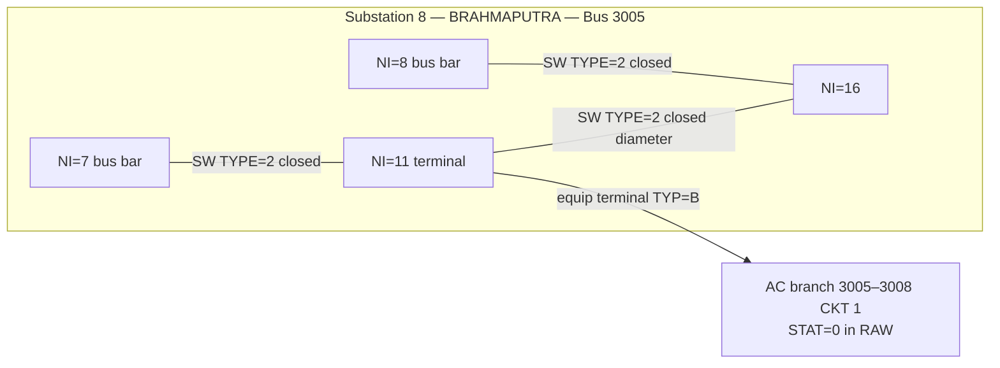
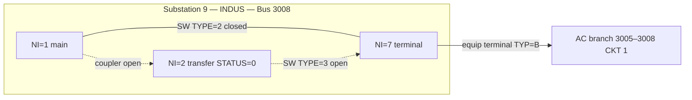
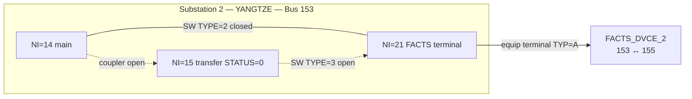
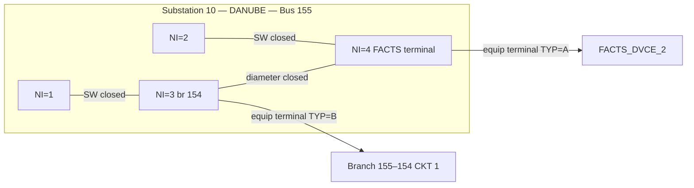

# PSS®E Sample Case — NB Connection Info for Two Branches

Node-breaker connection paths for:

| Branch id (InterPSS) | Equipment | From | To | CKT / name |
|----------------------|-----------|-----:|---:|------------|
| `Bus3005->Bus3008(1)` | AC branch | 3005 | 3008 | `1` |
| `Bus153->Bus155(FACTS_DVCE_2)` | FACTS device | 153 | 155 | `FACTS_DVCE_2` |

Fixture: [`sample_nb.raw`](sample_nb.raw).  
Station overview: [`sample-nb-substation-nbModel.md`](sample-nb-substation-nbModel.md).

Both links are **inter-substation**: each end has its own station terminals; there is **no** NB switch that crosses station boundaries. Connectivity between ends is only the bus-branch / FACTS element itself.

---

## 1. `Bus3005->Bus3008(1)`

### Bus-branch record

```
3005, 3008,'1 ', R=0.006, X=0.05, B=0.12, …, STAT=0, …
```

| Field | Value |
|-------|-------|
| From bus | **3005** `WEST` (230 kV) — Substation **8** `SS08_BRAHMAPUTRA_TYP_4_BH` |
| To bus | **3008** `CATDOG` (230 kV) — Substation **9** `SS09_INDUS_TYP_6_MBTB` |
| Circuit | `1` |
| STAT | **0** (out of service in the RAW base case) |

### Equipment terminals (both ends)

| Station | Bus | Node `NI` | Type | Terminal record |
|--------:|----:|----------:|:----:|-----------------|
| 8 BRAHMAPUTRA | 3005 | **11** | `B` | `3005, 11, 'B', 3008, '1 '` |
| 9 INDUS | 3008 | **7** | `B` | `3008, 7, 'B', 3005, '1 '` |

### End A — Station 8 / Bus 3005 (breaker-and-a-half)

Bus 3005 pocket: bars **NI=7** and **NI=8**; midpoints **NI=9…13** on bar 7 and **NI=14…18** on bar 8; diameters join midpoints across bars.

Path that pins branch CKT `1` onto the 3005 yard:

| Link | Nodes | TYPE | STATUS |
|------|------:|-----:|-------:|
| Bar → equip midpoint | 7–**11** | 2 | 1 (closed) |
| Diameter | **11**–16 | 2 | 1 (closed) |
| Equip midpoint → bar | 8–16 | 2 | 1 (closed) |



### End B — Station 9 / Bus 3008 (main / transfer)

Bus 3008 pocket: main bar **NI=1**, transfer bar **NI=2** (`STATUS=0`), equipment **NI=3…10**.

Path that pins the same branch onto the 3008 yard:

| Link | Nodes | TYPE | STATUS |
|------|------:|-----:|-------:|
| Main bar → equip | 1–**7** | 2 | 1 (closed) |
| Transfer → equip | 2–**7** | 3 | **0** (open) |
| Main ↔ transfer coupler | 1–2 | 2 | **0** (open) |



### End-to-end picture

```
SS08 BRAHMAPUTRA (BH)                 SS09 INDUS (MBTB)
Bus 3005                              Bus 3008
  NI=7 ──SW── NI=11 ════════════════════ NI=7 ──SW── NI=1
              │ terminal B                     terminal B
              └──── Branch CKT 1 (STAT=0) ─────┘
```

After import, InterPSS id is `Bus3005->Bus3008(1)`. With RAW `STAT=0` the branch starts **inactive**; enabling it (e.g. topo sample case 1) does not change the NB terminal pins above.

---

## 2. `Bus153->Bus155(FACTS_DVCE_2)`

### FACTS record

```
"FACTS_DVCE_2", 153, 155, MODE=1, PDES=350, QDES=40, VSET=1.015, … 
```

| Field | Value |
|-------|-------|
| Name | `FACTS_DVCE_2` |
| Sending bus `I` | **153** `MID230` (230 kV) — Substation **2** `SS02_YANGTZE_TYP_6_MBTB` |
| Terminal bus `J` | **155** — Substation **10** `SS10_DANUBE_TYP_4_BH` |
| MODE | `1` (in service for InterPSS: `status = mode != 0`) |
| Equip type code | `A` (FACTS) |

### Equipment terminals (both ends)

| Station | Bus | Node `NI` | Type | Terminal record |
|--------:|----:|----------:|:----:|-----------------|
| 2 YANGTZE | 153 | **21** | `A` | `153, 21, 'A','FACTS_DVCE_2'` |
| 10 DANUBE | 155 | **4** | `A` | `155, 4, 'A','FACTS_DVCE_2'` |

### End A — Station 2 / Bus 153 (main / transfer)

Bus 153 pocket: main **NI=14**, transfer **NI=15** (`STATUS=0`), equipment **NI=16…21**. FACTS_DVCE_2 shares this yard with load, xfmr `T3`, branch 153–154, system SWD 153–3006, and FACTS_DVCE_1.

| Link | Nodes | TYPE | STATUS |
|------|------:|-----:|-------:|
| Main bar → FACTS terminal | 14–**21** | 2 | 1 (closed) |
| Transfer → FACTS terminal | 15–**21** | 3 | **0** (open) |
| Main ↔ transfer coupler | 14–15 | 2 | **0** (open) |



### End B — Station 10 / Bus 155 (breaker-and-a-half)

Small BH pocket: bars **NI=1** / **NI=2**, midpoints **NI=3** (branch 155–154) and **NI=4** (FACTS).

| Link | Nodes | TYPE | STATUS |
|------|------:|-----:|-------:|
| Bar → midpoint (line) | 1–3 | 2 | 1 (closed) |
| Bar → midpoint (FACTS) | 2–**4** | 2 | 1 (closed) |
| Diameter | 3–**4** | 2 | 1 (closed) |



### End-to-end picture

```
SS02 YANGTZE (MBTB)                      SS10 DANUBE (BH)
Bus 153                                  Bus 155
  NI=14 ──SW── NI=21 ══════════════════════ NI=4 ──SW── NI=2
                │ terminal A                    terminal A
                └──── FACTS_DVCE_2 ─────────────┘
                                                    │ diameter
                                                 NI=3 ── branch 155–154
```

InterPSS id: `Bus153->Bus155(FACTS_DVCE_2)`.

---

## Comparison

| | `Bus3005->Bus3008(1)` | `Bus153->Bus155(FACTS_DVCE_2)` |
|--|----------------------|-------------------------------|
| Element kind | AC branch (`TYP=B`) | FACTS (`TYP=A`) |
| From station / layout | 8 BRAHMAPUTRA / BH | 2 YANGTZE / MBTB |
| To station / layout | 9 INDUS / MBTB | 10 DANUBE / BH |
| From terminal node | NI=**11** @ 3005 | NI=**21** @ 153 |
| To terminal node | NI=**7** @ 3008 | NI=**4** @ 155 |
| Cross-station NB switch? | No | No |
| Base-case service | Branch **STAT=0** | FACTS **MODE=1** (in service) |

---

## Why these show up in topo samples

Topo analysis assigns bus `intFlag` only from **closed** NB switches inside each station. Enabling an out-of-service branch (e.g. case 1 forcing `Bus3005->Bus3008(1)` active) does not by itself create a topo group if an end bus never gets a closed-switch component — that is separate from the terminal pinning documented here.
