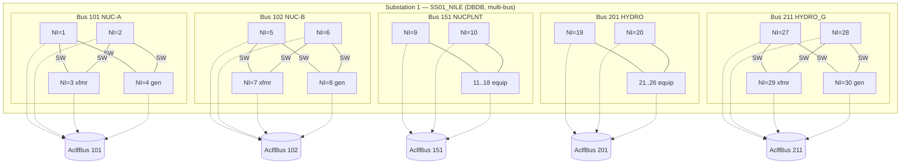
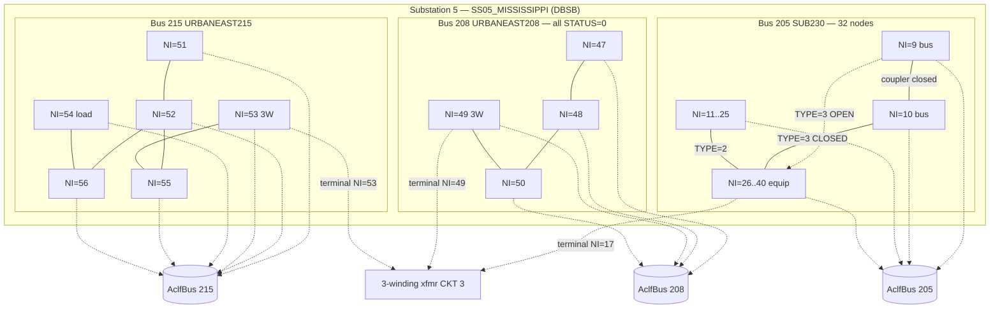
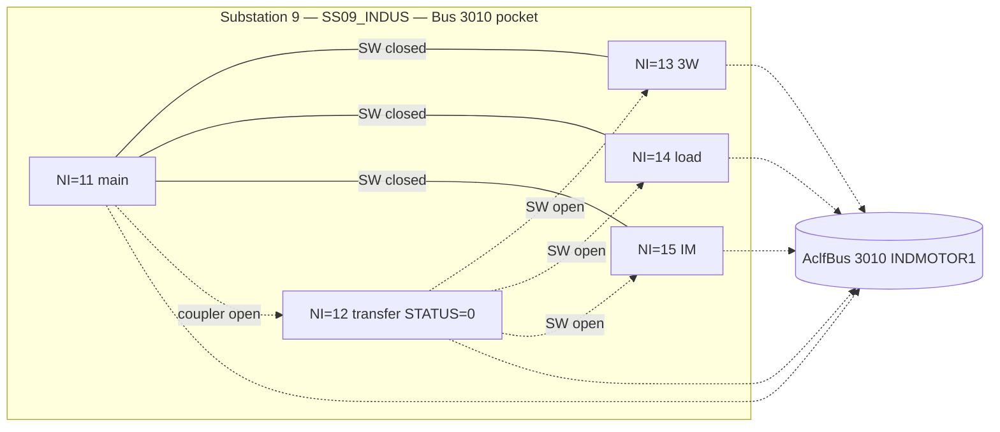
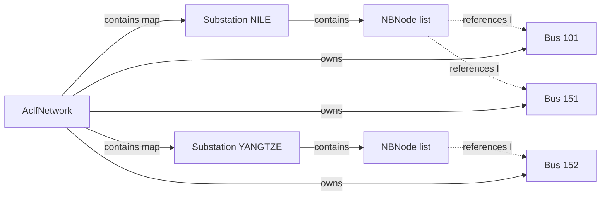

# PSS®E Sample Case — Substation ↔ NBNode Containing Relationship

Walk-through of how **substations contain nodes** in the PSS®E Substation Data Group, using the fixture:

[`sample_nb.raw`](sample_nb.raw)

(relative from `ipss-plugin`: `ipss.test.plugin.core/testData/psse/v36/sample_nb.raw`)

PSS®E-36 sample case: *“ALL RECORD GROUPS WITH SEQ DATA”*. The file banner says *“CONTAINS NODE BREAKERS BUT NO SUBSTN SECTIONS”*, but the RAW **does** include a full Substation Data Group (18 stations). Treat the banner as stale; this note describes what is actually in the file.

For the smaller IEEE14 overlay (one bus per station), see [`../nbreaker/ieee14-substation-nbModel.md`](../nbreaker/ieee14-substation-nbModel.md). This note focuses on **containment and references**, not import code.

---

## Containment model

Same InterPSS ownership tree as the IEEE14 fixture — substations own nodes, switches, and equipment terminals:

```
AclfNetwork
 └── SubstationMap
      ├── Substation "1" (SS01_NILE_…)
      │    ├── nbNodeList[]
      │    ├── nbSwitchList[]
      │    └── nbEquipConnectList[]
      ├── Substation "2" (SS02_YANGTZE_…)
      │    └── …
      └── … (18 stations total)
```

| Relationship | Cardinality | Meaning |
|--------------|-------------|---------|
| `Network` → `Substation` | 1 → N | Stations live on the network map (`substationMap`) |
| `Substation` → `NBNode` | 1 → N | Every node belongs to **exactly one** station |
| `NBNode` → `Bus` | N → 1 | Many nodes may share one electrical bus `I` |
| `Substation` → `Bus` | **1 → M** | Unlike IEEE14 here, **one station routinely spans several buses** (voltage levels / plant yards) |

Key rule from PSS®E: **node numbers (`NI`) are unique only inside one substation.** Station 1 node `1` and Station 2 node `1` are unrelated objects.

**Difference vs IEEE14 fixture:** each IEEE14 station maps every node to a **single** bus. In `sample_nb.raw`, large stations (NILE, YANGTZE, MISSISSIPPI, …) pack several electrical buses into one `IS`, with switches staying **inside** that station (never crossing station boundaries).

---

## What this fixture models

The RAW is the full PSS®E sample **bus-branch** case (~46 buses) plus a near-complete **node-breaker overlay**:

| | Count |
|--|------:|
| Substations (`IS`) | 18 |
| NB nodes | 292 |
| Substation switching devices | 363 |
| Equipment terminals | 171 |
| Buses with ≥1 NB node | 45 |
| Buses with **no** NB overlay | **3** — `301` NORTH, `401` COGEN-1, `402` COGEN-2 |

Station names encode a river mnemonic plus a breaker layout tag (`TYP_n_LAYOUT`):

| Layout tag | Typical meaning (from name) |
|------------|-----------------------------|
| `DBDB` | Double-bus double-breaker |
| `DBSB` | Double-bus single-breaker |
| `BH` | Breaker-and-a-half |
| `MBTB` | Main / transfer bus |
| `SB` | Single bus |
| `RB` | Ring bus |

### Station inventory

| `IS` | Name | Layout | Electrical buses on nodes | Nodes | Switches (closed/open) | Terminals |
|------|------|--------|---------------------------|------:|------------------------:|----------:|
| 1 | `SS01_NILE_TYP_3_DBDB` | DBDB | 101, 102, 151, 201, 211 | 30 | 40 / 0 | 20 |
| 2 | `SS02_YANGTZE_TYP_6_MBTB` | MBTB | 152, 153, 3006, 3021, 3022 | 39 | 29 / 34 | 29 |
| 3 | `SS03_ARKANSAS_TYP_4_BH` | BH | 154, 9154 | 18 | 21 / 0 | 14 |
| 4 | `SS04_COLORADO_TYP_5_DBSB` | DBSB | 202, 203, 70202 | 30 | 27 / 12 | 12 |
| 5 | `SS05_MISSISSIPPI_TYP_5_DBSB` | DBSB | 204, 205, 206, 208, 215, 9204 | 62 | 56 / 25 | 25 |
| 6 | `SS06_VOLGA_TYP_1_SB` | SB | 209, 217, 218 | 10 | 7 / 0 | 7 |
| 7 | `SS07_YUKON_TYP_4_BH` | BH | 3001, 3002, 3011, 93002 | 20 | 18 / 0 | 10 |
| 8 | `SS08_BRAHMAPUTRA_TYP_4_BH` | BH | 3004, 3005, 703005 | 22 | 24 / 0 | 14 |
| 9 | `SS09_INDUS_TYP_6_MBTB` | MBTB | 3008, 3010, 3012, 3018 | 23 | 15 / 19 | 15 |
| 10 | `SS10_DANUBE_TYP_4_BH` | BH | 155 | 4 | 3 / 0 | 2 |
| 11 | `SS11_ALLEGHENY_TYP_2_RB` | RB | 207 | 2 | 2 / 0 | 2 |
| 12 | `SS12_GANGES_TYP_2_RB` | RB | 212 | 3 | 3 / 0 | 3 |
| 13 | `SS13_OXUS_TYP_1_SB` | SB | 214 | 4 | 3 / 0 | 3 |
| 14 | `SS14_SALWEEN_TYP_1_SB` | SB | 216 | 3 | 2 / 0 | 2 |
| 15 | `SS15_HEILONG_TYP_3_DBDB` | DBDB | 213 | 5 | 6 / 0 | 3 |
| 16 | `SS16_ZAIRE_TYP_4_BH` | BH | 3003, 703003 | 10 | 9 / 0 | 5 |
| 17 | `SS17_ZAMBEZI_TYP_3_DBDB` | DBDB | 3007 | 5 | 6 / 0 | 3 |
| 18 | `SS18_PILCOMAYO_TYP_2_RB` | RB | 3009 | 2 | 2 / 0 | 2 |

Open switches and `STATUS=0` nodes appear mainly on the transfer-bus / DBSB stations (`YANGTZE`, `COLORADO`, `MISSISSIPPI`, `INDUS`) — useful for bus-split / transfer-bus scenarios.

### Terminal type codes in this file

| `TYP` | Count | Equipment |
|-------|------:|-----------|
| `B` | 66 | AC branch |
| `2` | 28 | Two-winding transformer |
| `L` | 21 | Load |
| `3` | 12 | Three-winding transformer |
| `F` | 13 | Fixed shunt |
| `S` | 9 | Switched shunt |
| `M` | 7 | Machine / generator |
| `V` | 4 | VSC DC line |
| `I` | 4 | Induction machine |
| `A` | 3 | FACTS device |
| `D` | 2 | Two-terminal DC line |
| `N` | 2 | GNE |

There are also **system switching devices** (bus-to-bus) outside the Substation Data Group: `151–201 '*1'` and `153–3006 '@1'` — those are network-level breakers, not members of a station’s `nbSwitchList`.

---

## Station 1 — NILE (multi-bus DBDB walkthrough)

Largest conceptually interesting station for **multi-bus containment**: five electrical buses in one `IS`, double-bus double-breaker style.

### RAW block (abbreviated)

```
1,'SS01_NILE_TYP_3_DBDB',34.6134987,-86.6737137,0.1100
1,'SS_NILE_NODE_1',101,1          ← NI, NAME, I=Bus101, STATUS
2,'SS_NILE_NODE_2',101,1
…
4,'SS_NILE_NODE_4',101,1
5,'SS_NILE_NODE_5',102,1
…
30,'SS_NILE_NODE_30',211,1
0
… 40 switching devices (all STATUS=1) …
… 20 terminals …
```

### Contained nodes → buses

| Node `NI` | Electrical bus | Bus name | Role (from topology) |
|-----------|----------------|----------|----------------------|
| 1–2 | 101 | `NUC-A` | Bus bars (21.6 kV gen A) |
| 3–4 | 101 | `NUC-A` | Equipment nodes (GSU T1 / gen) |
| 5–6 | 102 | `NUC-B` | Bus bars (21.6 kV gen B) |
| 7–8 | 102 | `NUC-B` | Equipment nodes (GSU T2 / gen) |
| 9–10 | 151 | `NUCPLNT` | Bus bars (500 kV plant) |
| 11–18 | 151 | `NUCPLNT` | Line / xfmr / shunt terminals |
| 19–20 | 201 | `HYDRO` | Bus bars (500 kV hydro) |
| 21–26 | 201 | `HYDRO` | Line / load / shunt / xfmr terminals |
| 27–28 | 211 | `HYDRO_G` | Bus bars (20 kV hydro gen) |
| 29–30 | 211 | `HYDRO_G` | Equipment nodes (GSU T6 / gen) |

### How switches connect nodes (inside Station 1)

Each voltage yard is a DBDB pocket: two bus-bar nodes, with breakers to each equipment node. Cross-voltage coupling is **not** done with substation switches — it is via transformers / branches pinned by terminals.



- **Containment (solid):** nodes and switches are children of Substation 1.
- **Reference (dotted):** each `NBNode.bus` points at its electrical bus; the bus is **not** contained by the node.
- Closed breakers merge nodes that share the same `I` into one topological section for bus-merge studies.

### Equipment terminals (pin equipment to a node)

| Bus | Node | Type | Equipment |
|-----|------|------|-----------|
| 101 | 4 | `M` | Gen `1` on Bus 101 |
| 101 | 3 | `2` | Xfmr 101–151 CKT `T1` (low side) |
| 102 | 8 | `M` | Gen `1` on Bus 102 |
| 102 | 7 | `2` | Xfmr 102–151 CKT `T2` (low side) |
| 151 | 16–18 | `F` | Fixed shunts `F1`/`F2`/`F3` |
| 151 | 14 | `2` | Xfmr 101–151 CKT `T1` (high side) |
| 151 | 15 | `2` | Xfmr 102–151 CKT `T2` (high side) |
| 151 | 11 | `B` | Branch 151–152 CKT `1` |
| 151 | 12 | `B` | Branch 151–152 CKT `2` |
| 151 | 13 | `B` | System SWD 151–201 CKT `*1` |
| 201 | 25 | `L` | Load `SC` |
| 201 | 26 | `F` | Fixed shunt `1` |
| 201 | 24 | `B` | System SWD 151–201 CKT `*1` (far end) |
| 201 | 21 | `B` | Branch 201–202 CKT `1` |
| 201 | 22 | `B` | Branch 201–207 CKT `C1` |
| 201 | 23 | `2` | Xfmr 201–211 CKT `T6` (high side) |
| 211 | 30 | `M` | Gen `1` on Bus 211 |
| 211 | 29 | `2` | Xfmr 201–211 CKT `T6` (low side) |

Terminals do not create a second containment tree: they are `NBEquipConnection` objects on the **same** substation, each holding a reference to one `NBNode`.

---

## Station 5 — MISSISSIPPI (buses 205, 208, 215)

Largest station in the file (`IS=5`, 62 nodes). Contains **six** electrical buses; this section focuses on the three the user usually cares about for urban-east topology — **205**, **208**, **215** — plus how they sit with siblings 204 / 206 / 9204 under the same containment root.

| Electrical bus | Name | kV (from bus data) | Nodes | Node STATUS | Role |
|----------------|------|--------------------|------:|-------------|------|
| 204 | `SUB500` | 500 | 8 | all in | 500 kV yard |
| **205** | `SUB230` | 230 | **32** | all in | Main 230 kV yard (DBSB) |
| 206 | `URBGEN` | 18 | 6 | all in | Urban gen |
| **208** | `URBANEAST208` | 230 | **4** | **all out** | Tertiary / parked 230 kV (IDE=4 in bus data) |
| **215** | `URBANEAST215` | 18 | **6** | all in | Urban load LV |
| 9204 | `INDMOTOR2` | 0.575 | 6 | all in | Induction motor |

Buses **205 / 208 / 215** are tied electrically by the **three-winding transformer** terminal `TYP='3'` (CKT `3`) — each winding pins to one node in those three yards. There are **no** cross-bus substation switches; coupling is only via equipment terminals.

### RAW block (abbreviated)

```
5,'SS05_MISSISSIPPI_TYP_5_DBSB',33.3773003,-82.6187973,0.1600
…
9,'SS_MISSISSIPPI_NODE_9',205,1      ← Bus 205 bus-bar / equip (NI 9–40)
…
40,'SS_MISSISSIPPI_NODE_40',205,1
…
47,'SS_MISSISSIPPI_NODE_47',208,0     ← Bus 208 — all STATUS=0
…
50,'SS_MISSISSIPPI_NODE_50',208,0
51,'SS_MISSISSIPPI_NODE_51',215,1     ← Bus 215 (NI 51–56)
…
56,'SS_MISSISSIPPI_NODE_56',215,1
0
… switches …
… terminals …
```

### Contained nodes → buses 205 / 208 / 215

| Node `NI` | Electrical bus | Role (from switch/terminal pattern) |
|-----------|----------------|-------------------------------------|
| 9–10 | 205 | Bus bars (DBSB: NI=9 transfer side mostly open; NI=10 main side closed) |
| 11–25 | 205 | Equipment nodes (branches, loads, shunts, xfmr, VSC) |
| 26–40 | 205 | Equipment nodes paired to 11–25 via TYPE=2 breakers |
| 47–48 | 208 | Bus bars (inactive nodes) |
| 49–50 | 208 | Equipment (3-winding tertiary on NI=49) |
| 51–52 | 215 | Bus bars (DBSB pocket) |
| 53–56 | 215 | Equipment (3-winding LV on NI=53; load `U1` on NI=54) |

### How switches connect nodes (205 / 208 / 215 pockets)

Classic **DBSB**: for Bus 205, NI=9↔10 bus-coupler closed; disconnects from bus-bar **9** to equip (26–40) are **open**; disconnects from bus-bar **10** to equip are **closed**; each equip pair (11–26, 12–27, …) has a closed TYPE=2 breaker. Bus 208 and 215 use the same pattern at smaller scale; Bus 208 nodes are all `STATUS=0`.



### Equipment terminals on 205 / 208 / 215

| Bus | Node | Type | Equipment |
|-----|------|------|-----------|
| 205 | 21 | `L` | Load `1` |
| 205 | 22 | `L` | Load `B` |
| 205 | 23 | `L` | Load `C` |
| 205 | 24 | `F` | Fixed shunt `1` |
| 205 | 18 | `B` | Branch 205–154 CKT `1` |
| 205 | 19 | `B` | Branch 205–203 CKT `1` |
| 205 | 20 | `2` | Xfmr 204–205 CKT `T8` (230 kV side) |
| 205 | 16 | `2` | Xfmr 205–206 CKT `T9` (230 kV side) |
| 205 | 11 | `B` | Branch 205–212 CKT `1` |
| 205 | 12 | `B` | Branch 205–214 CKT `2` |
| 205 | 13 | `B` | Branch 205–216 CKT `3` |
| 205 | 14 | `B` | Branch 205–217 CKT `4` |
| 205 | 15 | `B` | Branch 205–218 CKT `5` |
| 205 | 17 | `3` | 3-winding 205–208–215 CKT `3` (winding at 205) |
| 205 | 25 | `V` | VSC DC `VDCLINE2` |
| 208 | 49 | `3` | Same 3-winding CKT `3` (winding at 208) |
| 215 | 54 | `L` | Load `U1` |
| 215 | 53 | `3` | Same 3-winding CKT `3` (winding at 215) |

Sibling yards in the same station (not expanded here): Bus 204 terminals for `T8` / branch to 207 / xfmr to 9204; Bus 206 gen + `T9`; Bus 9204 induction machine + `W2`.

---

## Station 9 — INDUS (bus 3010)

`IS=9` `SS09_INDUS_TYP_6_MBTB` — main/transfer layout with many open switches. Contains four buses; **3010** (`INDMOTOR1`) is the industrial-motor LV pocket.

| Electrical bus | Name | Nodes | Node STATUS | Role |
|----------------|------|------:|-------------|------|
| 3008 | `CATDOG` | 10 | NI=2 out; rest in | 230 kV main yard |
| **3010** | `INDMOTOR1` | **5** | NI=12 out; rest in | 21.6 kV motor / load |
| 3012 | `URBNWEST3012` | 3 | **all out** | Parked tertiary (IDE=4) |
| 3018 | `CATDOG_G` | 5 | NI=20 out; rest in | Gen yard |

Buses **3008 / 3010 / 3012** share a **three-winding transformer** CKT `2`. Again: no cross-bus NB switches — only terminal pins.

### RAW block (abbreviated)

```
9,'SS09_INDUS_TYP_6_MBTB',…
…
11,'SS_INDUS_NODE_11',3010,1     ← Bus 3010
12,'SS_INDUS_NODE_12',3010,0     ← transfer bus-bar (inactive)
13,'SS_INDUS_NODE_13',3010,1     ← 3-winding terminal
14,'SS_INDUS_NODE_14',3010,1     ← load
15,'SS_INDUS_NODE_15',3010,1     ← induction machine
0
… switches …
… terminals …
```

### Contained nodes → bus 3010

| Node `NI` | Name pattern | STATUS | Role |
|-----------|--------------|--------|------|
| 11 | `SS_INDUS_NODE_11` | 1 | Main bus bar |
| 12 | `SS_INDUS_NODE_12` | **0** | Transfer bus bar (parked) |
| 13 | `SS_INDUS_NODE_13` | 1 | 3-winding xfmr terminal (to 3008 / 3012) |
| 14 | `SS_INDUS_NODE_14` | 1 | Load `1` |
| 15 | `SS_INDUS_NODE_15` | 1 | Induction machine `1` |

### How switches connect nodes (Bus 3010 pocket)

MBTB pattern: main bar NI=11 feeds equip with **closed** TYPE=2 switches; transfer bar NI=12 is inactive and all of its TYPE=3 links are **open**.



### Equipment terminals on Bus 3010 (and linking siblings)

| Bus | Node | Type | Equipment |
|-----|------|------|-----------|
| **3010** | **14** | `L` | Load `1` on Bus 3010 |
| **3010** | **15** | `I` | Induction machine `1` on Bus 3010 |
| **3010** | **13** | `3` | 3-winding 3008–3010–3012 CKT `2` (winding at 3010) |
| 3008 | 5 | `3` | Same 3-winding CKT `2` (winding at 3008) |
| 3012 | 18 | `3` | Same 3-winding CKT `2` (winding at 3012) |

Other INDUS terminals (same station, not on 3010): loads/branches/VSC on 3008; gens `1`/`2` and GSU `11` on 3018.

---

## Other patterns worth noting

### Station 2 — YANGTZE (open transfer bus)

Same multi-bus idea as NILE, but with many **open** switches (`STATUS=0`) and five inactive nodes — classic main/transfer layout where the second bus is parked. Also the richest terminal mix in the file: loads, fixed/switched shunts, branches, 2-winding xfmrs, FACTS (`A`), and two-terminal DC (`D`). See also MISSISSIPPI (DBSB) and INDUS (MBTB) above for the same open-transfer idea at different layouts.

### Small single-bus stations

Stations 10–15, 17–18 are the simple end of the spectrum (2–5 nodes, one bus) — closer to the IEEE14 “one station ↔ one bus” mental model, useful as minimal import checks.

### Containing vs referencing (summary)



| Link | Kind | Consequence |
|------|------|-------------|
| Substation owns NBNode | **Containment** | Node IDs are scoped as `{isub}-{inode}` |
| NBNode points to Bus | **Reference** | Bus-branch network stays intact; overlay only |
| One Substation → many Buses | **Multi-bus station** | Ask “which bus?” *and* “which station?” |
| NBSwitch between two NBNodes | **Reference inside same station** | Both ends must be in that station’s `nbNodeList` |
| NBEquipConnection → NBNode + equip | **Reference** | Locates where existing gen/load/branch/… attaches |
| System Switching Device | **Network-level** | Not owned by a substation block |

---

## Practical takeaway

1. Ask “which station?” first — `NI` alone is not globally unique.
2. Ask “which electrical bus?” via `NBNode.bus` / RAW field `I` — in this fixture a station often holds **several** `I` values.
3. Switches and terminals are siblings of nodes under the **same** `Substation`, not nested under `NBNode` as EMF children.
4. Open switches / inactive nodes (YANGTZE, MISSISSIPPI, …) are intentional for transfer-bus and bus-split studies — do not assume every switch is closed.
5. Buses `301`, `401`, `402` are present in the bus-branch model but have **no** substation overlay in this RAW.

This fixture is the expected large-sample shape for PSS®E v36 node-breaker import (18 stations; 292 / 363 / 171 node / switch / terminal counts).
